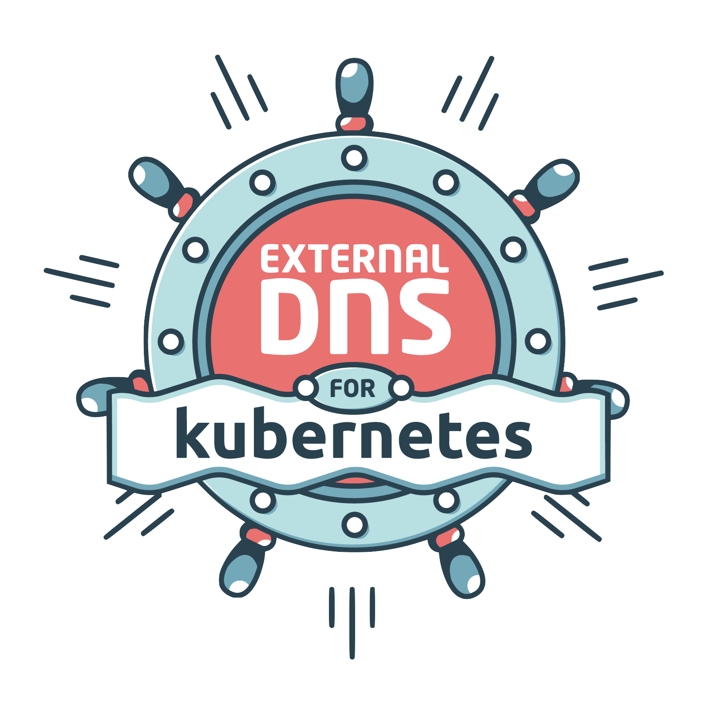

---
hide:
  - toc
  - navigation
---

<p align="center">
	
</p>

# ExternalDNS

[](https://github.com/kubernetes-sigs/external-dns/actions) [](https://coveralls.io/github/kubernetes-sigs/external-dns) [](https://github.com/kubernetes-sigs/external-dns/releases) [](https://godoc.org/github.com/kubernetes-sigs/external-dns) [](https://goreportcard.com/report/github.com/kubernetes-sigs/external-dns) [](https://kubernetes-sigs.github.io/external-dns/)


ExternalDNS synchronizes exposed Kubernetes Services and Ingresses with DNS providers.

## What It Does

Inspired by [Kubernetes DNS](https://github.com/kubernetes/dns), Kubernetes' cluster-internal DNS server, ExternalDNS makes Kubernetes resources discoverable via public DNS servers. Like KubeDNS, it retrieves a list of resources (Services, Ingresses, etc.) from the [Kubernetes API](https://kubernetes.io/docs/api/) to determine a desired list of DNS records. *Unlike* KubeDNS, however, it's not a DNS server itself, but merely configures other DNS providers accordingly—e.g. [AWS Route 53](https://aws.amazon.com/route53/) or [Google Cloud DNS](https://cloud.google.com/dns/docs/).

In a broader sense, ExternalDNS allows you to control DNS records dynamically via Kubernetes resources in a DNS provider-agnostic way.

The [FAQ](docs/faq.md) contains additional information and addresses several questions about key concepts of ExternalDNS.

To see ExternalDNS in action, have a look at this [video](https://www.youtube.com/watch?v=9HQ2XgL9YVI) or read this [blogpost](https://codemine.be/posts/20190125-devops-eks-externaldns/).

## The Latest Release

ExternalDNS allows you to keep selected zones (via `--domain-filter`) synchronized with Ingresses and Services of `type=LoadBalancer` and nodes in various cloud providers:
* [Google Cloud DNS](https://cloud.google.com/dns/docs/)
* [AWS Route 53](https://aws.amazon.com/route53/)
* [AWS Cloud Map](https://docs.aws.amazon.com/cloud-map/)
* [AzureDNS](https://azure.microsoft.com/en-us/services/dns)
* [BlueCat](https://bluecatnetworks.com)
* [CloudFlare](https://www.cloudflare.com/dns)
* [RcodeZero](https://www.rcodezero.at/)
* [DigitalOcean](https://www.digitalocean.com/products/networking)
* [DNSimple](https://dnsimple.com/)
* [Infoblox](https://www.infoblox.com/products/dns/)
* [Dyn](https://dyn.com/dns/)
* [OpenStack Designate](https://docs.openstack.org/designate/latest/)
* [PowerDNS](https://www.powerdns.com/)
* [CoreDNS](https://coredns.io/)
* [Exoscale](https://www.exoscale.com/dns/)
* [Oracle Cloud Infrastructure DNS](https://docs.cloud.oracle.com/iaas/Content/DNS/Concepts/dnszonemanagement.htm)
* [Linode DNS](https://www.linode.com/docs/networking/dns/)
* [RFC2136](https://tools.ietf.org/html/rfc2136)
* [NS1](https://ns1.com/)
* [TransIP](https://www.transip.eu/domain-name/)
* [VinylDNS](https://www.vinyldns.io)
* [Vultr](https://www.vultr.com)
* [OVH](https://www.ovh.com)
* [Scaleway](https://www.scaleway.com)
* [Akamai Edge DNS](https://learn.akamai.com/en-us/products/cloud_security/edge_dns.html)
* [GoDaddy](https://www.godaddy.com)
* [Gandi](https://www.gandi.net)
* [ANS Group SafeDNS](https://portal.ans.co.uk/safedns/)
* [IBM Cloud DNS](https://www.ibm.com/cloud/dns)
* [TencentCloud PrivateDNS](https://cloud.tencent.com/product/privatedns)
* [TencentCloud DNSPod](https://cloud.tencent.com/product/cns)
* [Plural](https://www.plural.sh/)

From this release, ExternalDNS can become aware of the records it is managing (enabled via `--registry=txt`), therefore ExternalDNS can safely manage non-empty hosted zones. We strongly encourage you to use `v0.5` (or greater) with `--registry=txt` enabled and `--txt-owner-id` set to a unique value that doesn't change for the lifetime of your cluster. You might also want to run ExternalDNS in a dry run mode (`--dry-run` flag) to see the changes to be submitted to your DNS Provider API.

Note that all flags can be replaced with environment variables; for instance,
`--dry-run` could be replaced with `EXTERNAL_DNS_DRY_RUN=1`, or
`--registry txt` could be replaced with `EXTERNAL_DNS_REGISTRY=txt`.

## Status of providers

ExternalDNS supports multiple DNS providers which have been implemented by the [ExternalDNS contributors](https://github.com/kubernetes-sigs/external-dns/graphs/contributors). Maintaining all of those in a central repository is a challenge and we have limited resources to test changes. This means that it is very hard to test all providers for possible regressions and, as written in the [Contributing](#Contributing) section, we encourage contributors to step in as maintainers for the individual providers and help by testing the integrations.

End-to-end testing of ExternalDNS is currently
[performed](https://github.com/zalando-incubator/kubernetes-on-aws/blob/dev/test/e2e/external_dns.go)
in the separate
[kubernetes-on-aws](https://github.com/zalando-incubator/kubernetes-on-aws)
repository.

We define the following stability levels for providers:

- **Stable**: Used for smoke tests before a release, used in production and maintainers are active.
- **Beta**: Community supported, well tested, but maintainers have no access to resources to execute integration tests on the real platform and/or are not using it in production.
- **Alpha**: Community provided with no support from the maintainers apart from reviewing PRs.

The following table clarifies the current status of the providers according to the aforementioned stability levels:

| Provider | Status | Maintainers |
| -------- | ------ | ----------- |
| Google Cloud DNS | Stable | |
| AWS Route 53 | Stable | |
| AWS Cloud Map | Beta | |
| Akamai Edge DNS | Beta | |
| AzureDNS | Beta | |
| BlueCat | Alpha | @seanmalloy  @vinny-sabatini |
| CloudFlare | Beta | |
| RcodeZero | Alpha | |
| DigitalOcean | Alpha | |
| DNSimple | Alpha | |
| Infoblox | Alpha | @saileshgiri |
| Dyn | Alpha | |
| OpenStack Designate | Alpha | |
| PowerDNS | Alpha | |
| CoreDNS | Alpha | |
| Exoscale | Alpha | |
| Oracle Cloud Infrastructure DNS | Alpha | |
| Linode DNS | Alpha | |
| RFC2136 | Alpha | |
| NS1 | Alpha | |
| TransIP | Alpha | |
| VinylDNS | Alpha | |
| RancherDNS | Alpha | |
| OVH | Alpha | |
| Scaleway DNS | Alpha | @Sh4d1 |
| Vultr | Alpha | |
| UltraDNS | Alpha | |
| GoDaddy | Alpha | |
| Gandi | Alpha | @packi |
| SafeDNS | Alpha | @assureddt |
| IBMCloud | Alpha | @hughhuangzh |
| TencentCloud | Alpha | @Hyzhou |
| Plural | Alpha | @michaeljguarino |

## Kubernetes version compatibility

A [breaking change](https://github.com/kubernetes-sigs/external-dns/pull/2281) was added in external-dns v0.10.0. 

| ExternalDNS                    |      <= 0.9.x      |     >= 0.10.0      |
| ------------------------------ | :----------------: | :----------------: |
| Kubernetes <= 1.18             | :white_check_mark: |        :x:         |
| Kubernetes >= 1.19 and <= 1.21 | :white_check_mark: | :white_check_mark: |
| Kubernetes >= 1.22             |        :x:         | :white_check_mark: |

## Running ExternalDNS:

The are two ways of running ExternalDNS:

* Deploying to a Cluster
* Running Locally

### Deploying to a Cluster

The following tutorials are provided:

* [Akamai Edge DNS](docs/tutorials/akamai-edgedns.md)
* [Alibaba Cloud](docs/tutorials/alibabacloud.md)
* AWS
	* [ALB Ingress Controller](docs/tutorials/alb-ingress.md)
	* [Route53](docs/tutorials/aws.md)
		* [Same domain for public and private Route53 zones](docs/tutorials/public-private-route53.md)
	* [Cloud Map](docs/tutorials/aws-sd.md)
	* [Kube Ingress AWS Controller](docs/tutorials/kube-ingress-aws.md)
* [Azure DNS](docs/tutorials/azure.md)
* [Azure Private DNS](docs/tutorials/azure-private-dns.md)
* [Cloudflare](docs/tutorials/cloudflare.md)
* [BlueCat](docs/tutorials/bluecat.md)
* [CoreDNS](docs/tutorials/coredns.md)
* [DigitalOcean](docs/tutorials/digitalocean.md)
* [DNSimple](docs/tutorials/dnsimple.md)
* [Dyn](docs/tutorials/dyn.md)
* [Exoscale](docs/tutorials/exoscale.md)
* [ExternalName Services](docs/tutorials/externalname.md)
* Google Kubernetes Engine
	* [Using Google's Default Ingress Controller](docs/tutorials/gke.md)
	* [Using the Nginx Ingress Controller](docs/tutorials/nginx-ingress.md)
* [Headless Services](docs/tutorials/hostport.md)
* [Infoblox](docs/tutorials/infoblox.md)
* [Istio Gateway Source](docs/tutorials/istio.md)
* [Kubernetes Security Context](docs/tutorials/security-context.md)
* [Linode](docs/tutorials/linode.md)
* [Nginx Ingress Controller](docs/tutorials/nginx-ingress.md)
* [NS1](docs/tutorials/ns1.md)
* [NS Record Creation with CRD Source](docs/tutorials/ns-record.md)
* [OpenStack Designate](docs/tutorials/designate.md)
* [Oracle Cloud Infrastructure (OCI) DNS](docs/tutorials/oracle.md)
* [PowerDNS](docs/tutorials/pdns.md)
* [RcodeZero](docs/tutorials/rcodezero.md)
* [RancherDNS (RDNS)](docs/tutorials/rdns.md)
* [RFC2136](docs/tutorials/rfc2136.md)
* [TransIP](docs/tutorials/transip.md)
* [VinylDNS](docs/tutorials/vinyldns.md)
* [OVH](docs/tutorials/ovh.md)
* [Scaleway](docs/tutorials/scaleway.md)
* [Vultr](docs/tutorials/vultr.md)
* [UltraDNS](docs/tutorials/ultradns.md)
* [GoDaddy](docs/tutorials/godaddy.md)
* [Gandi](docs/tutorials/gandi.md)
* [SafeDNS](docs/tutorials/UKFast_SafeDNS.md)
* [IBM Cloud](docs/tutorials/ibmcloud.md)
* [Nodes as source](docs/tutorials/nodes.md)
* [TencentCloud](docs/tutorials/tencentcloud.md)
* [Plural](docs/tutorials/plural.md)

### Running Locally

See the [contributor guide](docs/contributing/getting-started.md) for details on compiling
from source.

#### Setup Steps

Next, run an application and expose it via a Kubernetes Service:

```console
kubectl run nginx --image=nginx --port=80
kubectl expose pod nginx --port=80 --target-port=80 --type=LoadBalancer
```

Annotate the Service with your desired external DNS name. Make sure to change `example.org` to your domain.

```console
kubectl annotate service nginx "external-dns.alpha.kubernetes.io/hostname=nginx.example.org."
```

Optionally, you can customize the TTL value of the resulting DNS record by using the `external-dns.alpha.kubernetes.io/ttl` annotation:

```console
kubectl annotate service nginx "external-dns.alpha.kubernetes.io/ttl=10"
```

For more details on configuring TTL, see [here](docs/ttl.md).

Use the internal-hostname annotation to create DNS records with ClusterIP as the target.

```console
kubectl annotate service nginx "external-dns.alpha.kubernetes.io/internal-hostname=nginx.internal.example.org."
```

If the service is not of type Loadbalancer you need the --publish-internal-services flag.

Locally run a single sync loop of ExternalDNS.

```console
external-dns --registry txt --txt-owner-id my-cluster-id --provider google --google-project example-project --source service --once --dry-run
```

This should output the DNS records it will modify to match the managed zone with the DNS records you desire. It also assumes you are running in the `default` namespace. See the [FAQ](docs/faq.md) for more information regarding namespaces.

Note: TXT records will have `my-cluster-id` value embedded. Those are used to ensure that ExternalDNS is aware of the records it manages.

Once you're satisfied with the result, you can run ExternalDNS like you would run it in your cluster: as a control loop, and **not in dry-run** mode:

```console
external-dns --registry txt --txt-owner-id my-cluster-id --provider google --google-project example-project --source service
```

Check that ExternalDNS has created the desired DNS record for your Service and that it points to its load balancer's IP. Then try to resolve it:

```console
dig +short nginx.example.org.
104.155.60.49
```

Now you can experiment and watch how ExternalDNS makes sure that your DNS records are configured as desired. Here are a couple of things you can try out:
* Change the desired hostname by modifying the Service's annotation.
* Recreate the Service and see that the DNS record will be updated to point to the new load balancer IP.
* Add another Service to create more DNS records.
* Remove Services to clean up your managed zone.

The [tutorials](docs/tutorials) section contains examples, including Ingress resources, and shows you how to set up ExternalDNS in different environments such as other cloud providers and alternative Ingress controllers.

# Note

If using a txt registry and attempting to use a CNAME the `--txt-prefix` must be set to avoid conflicts.  Changing `--txt-prefix` will result in lost ownership over previously created records.

If `externalIPs` list is defined for a `LoadBalancer` service, this list will be used instead of an assigned load balancer IP to create a DNS record. It's useful when you run bare metal Kubernetes clusters behind NAT or in a similar setup, where a load balancer IP differs from a public IP (e.g. with [MetalLB](https://metallb.universe.tf)).

# Roadmap

ExternalDNS was built with extensibility in mind. Adding and experimenting with new DNS providers and sources of desired DNS records should be as easy as possible. It should also be possible to modify how ExternalDNS behaves—e.g. whether it should add records but never delete them.

Here's a rough outline on what is to come (subject to change):

### v0.1

- [x] Support for Google CloudDNS
- [x] Support for Kubernetes Services

### v0.2

- [x] Support for AWS Route 53
- [x] Support for Kubernetes Ingresses

### v0.3

- [x] Support for AWS Route 53 via ALIAS
- [x] Support for multiple zones
- [x] Ownership System

### v0.4

- [x] Support for AzureDNS
- [x] Support for CloudFlare
- [x] Support for DigitalOcean
- [x] Multiple DNS names per Service

### v0.5

- [x] Support for creating DNS records to multiple targets (for Google and AWS)
- [x] Support for OpenStack Designate
- [x] Support for PowerDNS
- [x] Support for Linode
- [x] Support for RcodeZero
- [x] Support for NS1
- [x] Support for TransIP
- [x] Support for Azure Private DNS

### v0.6

- [ ] Ability to replace kOps' [DNS Controller](https://github.com/kubernetes/kops/tree/HEAD/dns-controller) (This could also directly become `v1.0`)
- [x] Support for OVH

### v1.0

- [ ] Ability to replace kOps' [DNS Controller](https://github.com/kubernetes/kops/tree/HEAD/dns-controller)
	- [x] Add support for pod source
	- [x] Add support for DNS Controller annotations for pod and service sources
	- [ ] Add support for kOps gossip provider
- [x] Ability to replace Zalando's [Mate](https://github.com/linki/mate)
- [x] Ability to replace Molecule Software's [route53-kubernetes](https://github.com/wearemolecule/route53-kubernetes)

### Yet to be defined

* Support for CoreDNS
* Support for record weights
* Support for different behavioral policies
* Support for Services with `type=NodePort`
* Support for CRDs
* Support for more advanced DNS record configurations

Have a look at [the milestones](https://github.com/kubernetes-sigs/external-dns/milestones) to get an idea of where we currently stand.

## Contributing

Are you interested in contributing to external-dns? We, the maintainers and community, would love your
suggestions, contributions, and help! Also, the maintainers can be contacted at any time to learn more
about how to get involved.

We also encourage ALL active community participants to act as if they are maintainers, even if you don't have
"official" write permissions. This is a community effort, we are here to serve the Kubernetes community. If you
have an active interest and you want to get involved, you have real power! Don't assume that the only people who
can get things done around here are the "maintainers". We also would love to add more "official" maintainers, so
show us what you can do!

The external-dns project is currently in need of maintainers for specific DNS providers. Ideally each provider
would have at least two maintainers. It would be nice if the maintainers run the provider in production, but it
is not strictly required. Provider listed [here](https://github.com/kubernetes-sigs/external-dns#status-of-providers)
that do not have a maintainer listed are in need of assistance.

Read the [contributing guidelines](CONTRIBUTING.md) and have a look at [the contributing docs](docs/contributing/getting-started.md) to learn about building the project, the project structure, and the purpose of each package.

For an overview on how to write new Sources and Providers check out [Sources and Providers](docs/contributing/sources-and-providers.md).

## Heritage

ExternalDNS is an effort to unify the following similar projects in order to bring the Kubernetes community an easy and predictable way of managing DNS records across cloud providers based on their Kubernetes resources:

* Kops' [DNS Controller](https://github.com/kubernetes/kops/tree/HEAD/dns-controller)
* Zalando's [Mate](https://github.com/linki/mate)
* Molecule Software's [route53-kubernetes](https://github.com/wearemolecule/route53-kubernetes)

### User Demo How-To Blogs and Examples

* A full demo on GKE Kubernetes. See [How-to Kubernetes with DNS management (ssl-manager pre-req)](https://medium.com/@jpantjsoha/how-to-kubernetes-with-dns-management-for-gitops-31239ea75d8d)
* Run external-dns on GKE with workload identity. See [Kubernetes, ingress-nginx, cert-manager & external-dns](https://blog.atomist.com/kubernetes-ingress-nginx-cert-manager-external-dns/)
