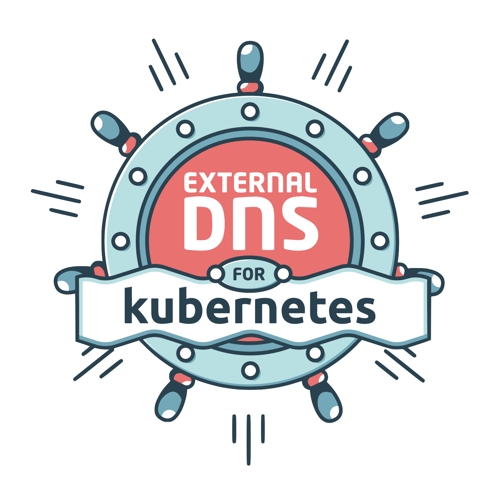

<p align="center">
	
</p>

# ExternalDNS
[](https://travis-ci.org/kubernetes-incubator/external-dns)
[](https://coveralls.io/github/kubernetes-incubator/external-dns?branch=master)
[](https://github.com/kubernetes-incubator/external-dns/releases)
[](https://godoc.org/github.com/kubernetes-incubator/external-dns)
[](https://goreportcard.com/report/github.com/kubernetes-incubator/external-dns)

ExternalDNS synchronizes exposed Kubernetes Services and Ingresses with DNS providers.

## What It Does

Inspired by [Kubernetes DNS](https://github.com/kubernetes/dns), Kubernetes' cluster-internal DNS server, ExternalDNS makes Kubernetes resources discoverable via public DNS servers. Like KubeDNS, it retrieves a list of resources (Services, Ingresses, etc.) from the [Kubernetes API](https://kubernetes.io/docs/api/) to determine a desired list of DNS records. *Unlike* KubeDNS, however, it's not a DNS server itself, but merely configures other DNS providers accordingly—e.g. [AWS Route 53](https://aws.amazon.com/route53/) or [Google Cloud DNS](https://cloud.google.com/dns/docs/).

In a broader sense, ExternalDNS allows you to control DNS records dynamically via Kubernetes resources in a DNS provider-agnostic way.

The [FAQ](docs/faq.md) contains additional information and addresses several questions about key concepts of ExternalDNS.

To see ExternalDNS in action, have a look at this [video](https://www.youtube.com/watch?v=9HQ2XgL9YVI).

## The Latest Release: v0.5

ExternalDNS' current release is `v0.5`. This version allows you to keep selected zones (via `--domain-filter`) synchronized with Ingresses and Services of `type=LoadBalancer` in various cloud providers:
* [Google Cloud DNS](https://cloud.google.com/dns/docs/)
* [AWS Route 53](https://aws.amazon.com/route53/)
* [AWS Service Discovery](https://docs.aws.amazon.com/Route53/latest/APIReference/overview-service-discovery.html)
* [AzureDNS](https://azure.microsoft.com/en-us/services/dns)
* [CloudFlare](https://www.cloudflare.com/dns)
* [DigitalOcean](https://www.digitalocean.com/products/networking)
* [DNSimple](https://dnsimple.com/)
* [Infoblox](https://www.infoblox.com/products/dns/)
* [Dyn](https://dyn.com/dns/)
* [OpenStack Designate](https://docs.openstack.org/designate/latest/)
* [PowerDNS](https://www.powerdns.com/)
* [CoreDNS](https://coredns.io/)
* [Exoscale](https://www.exoscale.com/dns/)
* [Oracle Cloud Infrastructure DNS](https://docs.cloud.oracle.com/iaas/Content/DNS/Concepts/dnszonemanagement.htm)
* [Linode DNS](https://www.linode.com/docs/networking/dns/)
* [RFC2136](https://tools.ietf.org/html/rfc2136)  

From this release, ExternalDNS can become aware of the records it is managing (enabled via `--registry=txt`), therefore ExternalDNS can safely manage non-empty hosted zones. We strongly encourage you to use `v0.5` (or greater) with `--registry=txt` enabled and `--txt-owner-id` set to a unique value that doesn't change for the lifetime of your cluster. You might also want to run ExternalDNS in a dry run mode (`--dry-run` flag) to see the changes to be submitted to your DNS Provider API.

Note that all flags can be replaced with environment variables; for instance,
`--dry-run` could be replaced with `EXTERNAL_DNS_DRY_RUN=1`, or
`--registry txt` could be replaced with `EXTERNAL_DNS_REGISTRY=txt`.

## Deploying to a Cluster

The following tutorials are provided:

* [Alibaba Cloud](docs/tutorials/alibabacloud.md)
* [AWS (Route53)](docs/tutorials/aws.md)
* [AWS (Service Discovery)](docs/tutorials/aws-sd.md)
* [Azure](docs/tutorials/azure.md)
* [CoreDNS](docs/tutorials/coredns.md)
* [Cloudflare](docs/tutorials/cloudflare.md)
* [DigitalOcean](docs/tutorials/digitalocean.md)
* [Infoblox](docs/tutorials/infoblox.md)
* [Dyn](docs/tutorials/dyn.md)
* Google Container Engine
	* [Using Google's Default Ingress Controller](docs/tutorials/gke.md)
	* [Using the Nginx Ingress Controller](docs/tutorials/nginx-ingress.md)
* [Exoscale](docs/tutorials/exoscale.md)
* [Oracle Cloud Infrastructure (OCI) DNS](docs/tutorials/oracle.md)
* [Linode](docs/tutorials/linode.md)
* [RFC2136](docs/tutorials/rfc2136.md)

## Running Locally

### Technical Requirements

Make sure you have the following prerequisites:
* A local Go 1.7+ development environment.
* Access to a Google/AWS account with the DNS API enabled.
* Access to a Kubernetes cluster that supports exposing Services, e.g. GKE.

### Setup Steps

First, get ExternalDNS:

**To install all dependencies, make sure to install [dep](https://github.com/golang/dep) first.**

```console
$ git clone https://github.com/kubernetes-incubator/external-dns.git && cd external-dns
$ dep ensure -vendor-only
$ make
```

This will create external-dns in the build directory directly from master.

Next, run an application and expose it via a Kubernetes Service:

```console
$ kubectl run nginx --image=nginx --replicas=1 --port=80
$ kubectl expose deployment nginx --port=80 --target-port=80 --type=LoadBalancer
```

Annotate the Service with your desired external DNS name. Make sure to change `example.org` to your domain.

```console
$ kubectl annotate service nginx "external-dns.alpha.kubernetes.io/hostname=nginx.example.org."
```

Optionally, you can customize the TTL value of the resulting DNS record by using the `external-dns.alpha.kubernetes.io/ttl` annotation:

```console
$ kubectl annotate service nginx "external-dns.alpha.kubernetes.io/ttl=10"
```

For more details on configuring TTL, see [here](docs/ttl.md).

Locally run a single sync loop of ExternalDNS.

```console
$ external-dns --registry txt --txt-owner-id my-cluster-id --provider google --google-project example-project --source service --once --dry-run
```

This should output the DNS records it will modify to match the managed zone with the DNS records you desire. Note TXT records having `my-cluster-id` value embedded. Those are used to ensure that ExternalDNS is aware of the records it manages.

Once you're satisfied with the result, you can run ExternalDNS like you would run it in your cluster: as a control loop, and **not in dry-run** mode:

```console
$ external-dns --registry txt --txt-owner-id my-cluster-id --provider google --google-project example-project --source service
```

Check that ExternalDNS has created the desired DNS record for your Service and that it points to its load balancer's IP. Then try to resolve it:

```console
$ dig +short nginx.example.org.
104.155.60.49
```

Now you can experiment and watch how ExternalDNS makes sure that your DNS records are configured as desired. Here are a couple of things you can try out:
* Change the desired hostname by modifying the Service's annotation.
* Recreate the Service and see that the DNS record will be updated to point to the new load balancer IP.
* Add another Service to create more DNS records.
* Remove Services to clean up your managed zone.

The [tutorials](docs/tutorials) section contains examples, including Ingress resources, and shows you how to set up ExternalDNS in different environments such as other cloud providers and alternative Ingress controllers.

# Note

If using a txt registry and attempting to use a CNAME the `--txt-prefix` must be set to avoid conflicts.  Changing `--txt-prefix` will result in lost ownership over previously created records.

# Roadmap

ExternalDNS was built with extensibility in mind. Adding and experimenting with new DNS providers and sources of desired DNS records should be as easy as possible. It should also be possible to modify how ExternalDNS behaves—e.g. whether it should add records but never delete them.

Here's a rough outline on what is to come (subject to change):

### v0.1

- [x] Support for Google CloudDNS
- [x] Support for Kubernetes Services

### v0.2

- [x] Support for AWS Route 53
- [x] Support for Kubernetes Ingresses

### v0.3

- [x] Support for AWS Route 53 via ALIAS
- [x] Support for multiple zones
- [x] Ownership System

### v0.4

- [x] Support for AzureDNS
- [x] Support for CloudFlare
- [x] Support for DigitalOcean
- [x] Multiple DNS names per Service

### v0.5 - _current version_

- [x] Support for creating DNS records to multiple targets (for Google and AWS)
- [x] Support for OpenStack Designate
- [x] Support for PowerDNS
- [x] Support for Linode

### v0.6

- [ ] Ability to replace Kops' [DNS Controller](https://github.com/kubernetes/kops/tree/master/dns-controller) (This could also directly become `v1.0`)

### v1.0

- [ ] Ability to replace Kops' [DNS Controller](https://github.com/kubernetes/kops/tree/master/dns-controller)
- [x] Ability to replace Zalando's [Mate](https://github.com/linki/mate)
- [x] Ability to replace Molecule Software's [route53-kubernetes](https://github.com/wearemolecule/route53-kubernetes)

### Yet to be defined

* Support for CoreDNS
* Support for record weights
* Support for different behavioral policies
* Support for Services with `type=NodePort`
* Support for CRDs
* Support for more advanced DNS record configurations

Have a look at [the milestones](https://github.com/kubernetes-incubator/external-dns/milestones) to get an idea of where we currently stand.

## Contributing

We encourage you to get involved with ExternalDNS, as users, contributors or as new maintainers that can take over some parts like different providers and help with code reviews.

Providers which currently need maintainers:

* Azure
* Cloudflare
* Digital Ocean
* Google Cloud Platform

Any provider should have at least one maintainer. It would be nice if you run it in production, but it is not required.
You should check changes and make sure your provider is working correctly.

It would be also great to have an automated end-to-end test for different cloud providers, so help from Kubernetes maintainers and their idea on how this can be done would be valuable.

Read the [contributing guidelines](CONTRIBUTING.md) and have a look at [the contributing docs](docs/contributing/getting-started.md) to learn about building the project, the project structure, and the purpose of each package.

If you are interested please reach out to us on the [Kubernetes slack](http://slack.k8s.io) in the #external-dns channel.

For an overview on how to write new Sources and Providers check out [Sources and Providers](docs/contributing/sources-and-providers.md).

## Heritage

ExternalDNS is an effort to unify the following similar projects in order to bring the Kubernetes community an easy and predictable way of managing DNS records across cloud providers based on their Kubernetes resources:

* Kops' [DNS Controller](https://github.com/kubernetes/kops/tree/master/dns-controller)
* Zalando's [Mate](https://github.com/linki/mate)
* Molecule Software's [route53-kubernetes](https://github.com/wearemolecule/route53-kubernetes)

## Kubernetes Incubator

This is a [Kubernetes Incubator project](https://github.com/kubernetes/community/blob/master/incubator.md).
The project was established 2017-Feb-9 (initial announcement [here](https://groups.google.com/forum/#!searchin/kubernetes-dev/external$20dns%7Csort:relevance/kubernetes-dev/2wGQUB0fUuE/9OXz01i2BgAJ)).
The incubator team for the project is:

* Sponsor: sig-network
* Champion: Tim Hockin (@thockin)
* SIG: sig-network

For more information about sig-network, such as meeting times and agenda, check out the [community site](https://github.com/kubernetes/community/tree/master/sig-network).

### Code of conduct

Participation in the Kubernetes community is governed by the [Kubernetes Code of Conduct](code-of-conduct.md).
