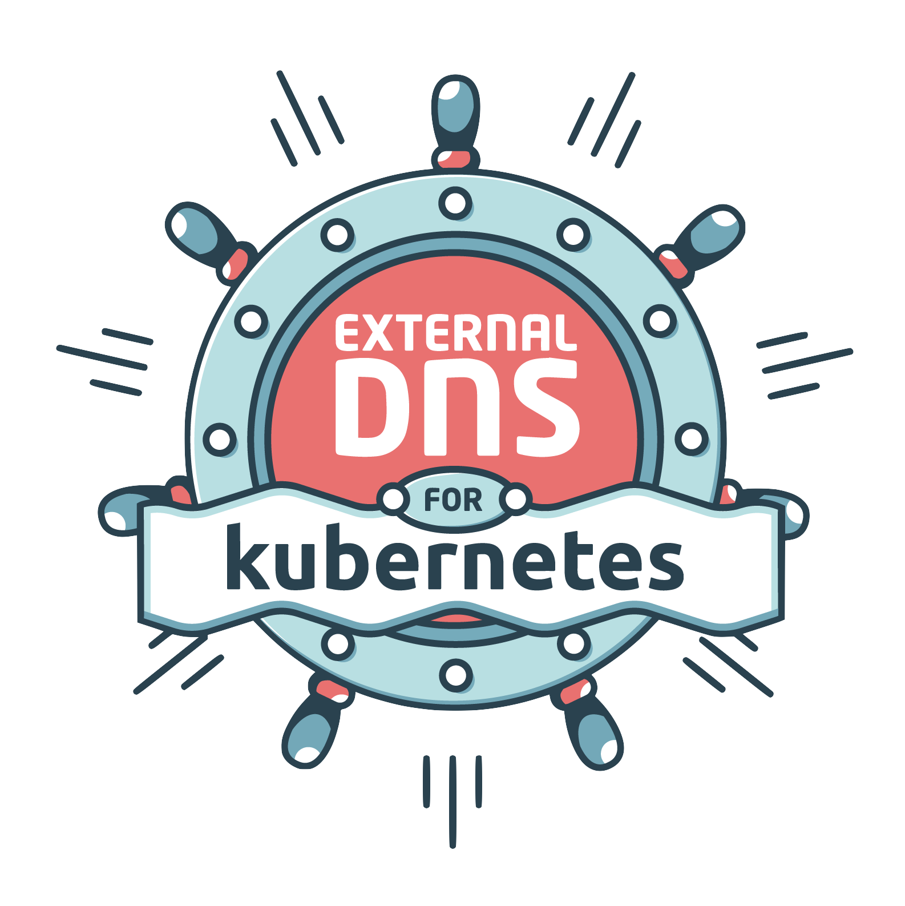

---
hide:
  - toc
  - navigation
---

<p align="center">
 
</p>

# ExternalDNS

[](https://github.com/kubernetes-sigs/external-dns/actions)
[](https://coveralls.io/github/kubernetes-sigs/external-dns)
[](https://scorecard.dev/viewer/?uri=github.com/kubernetes-sigs/external-dns)
[](https://github.com/kubernetes-sigs/external-dns/releases)
[](https://godoc.org/github.com/kubernetes-sigs/external-dns)
[](https://goreportcard.com/report/github.com/kubernetes-sigs/external-dns)
[](https://kubernetes-sigs.github.io/external-dns/)
[](https://deepwiki.com/kubernetes-sigs/external-dns)

ExternalDNS synchronizes exposed Kubernetes Services and Ingresses with DNS providers.

## Documentation

This README is a part of the complete [documentation, available here](https://kubernetes-sigs.github.io/external-dns/) and [DeepWiki](https://deepwiki.com/kubernetes-sigs/external-dns).

## What It Does

Inspired by [Kubernetes DNS](https://github.com/kubernetes/dns), Kubernetes' cluster-internal DNS server, ExternalDNS makes Kubernetes resources discoverable via public DNS servers.
Like KubeDNS, it retrieves a list of resources (Services, Ingresses, etc.) from the [Kubernetes API](https://kubernetes.io/docs/api/) to determine a desired list of DNS records.
_Unlike_ KubeDNS, however, it's not a DNS server itself, but merely configures other DNS providers accordingly—e.g. [AWS Route 53](https://aws.amazon.com/route53/) or [Google Cloud DNS](https://cloud.google.com/dns/docs/).

In a broader sense, ExternalDNS allows you to control DNS records dynamically via Kubernetes resources in a DNS provider-agnostic way.

The [FAQ](docs/faq.md) contains additional information and addresses several questions about key concepts of ExternalDNS.

To see ExternalDNS in action, have a look at this [video](https://www.youtube.com/watch?v=9HQ2XgL9YVI) or read this [blogpost](https://codemine.be/posts/20190125-devops-eks-externaldns/).

## Running ExternalDNS

ExternalDNS allows you to keep selected zones (via `--domain-filter`) synchronized with Ingresses and Services of `type=LoadBalancer` and nodes in many DNS providers. See [In-tree providers](#in-tree-providers) for the built-in list, and [New providers](#new-providers) for webhook-based ones.

ExternalDNS is, by default, aware of the records it is managing, therefore it can safely manage non-empty hosted zones.
We strongly encourage you to set `--txt-owner-id` to a unique value that doesn't change for the lifetime of your cluster.
You might also want to run ExternalDNS in a dry run mode (`--dry-run` flag) to see the changes to be submitted to your DNS Provider API.

Note that all flags can be replaced with environment variables; for instance,
`--dry-run` could be replaced with `EXTERNAL_DNS_DRY_RUN=1`.

ExternalDNS runs as a controller in your cluster, and can also be run locally to test a configuration. For provider-specific setup, see the [In-tree providers](#in-tree-providers) table (each row links its tutorial) or the [webhook providers](#new-providers).
More tutorials — ingress controllers, sources, and provider extras — are in the [full documentation](https://kubernetes-sigs.github.io/external-dns/).

<details>
<summary><b>Running Locally</b></summary>

See the [contributor guide](docs/contributing/dev-guide.md) for details on compiling
from source.

### Setup Steps

Next, run an application and expose it via a Kubernetes Service:

```console
kubectl run nginx --image=nginx --port=80
kubectl expose pod nginx --port=80 --target-port=80 --type=LoadBalancer
```

Annotate the Service with your desired external DNS name. Make sure to change `example.org` to your domain.

```console
kubectl annotate service nginx "external-dns.kubernetes.io/hostname=nginx.example.org."
```

Optionally, you can customize the TTL value of the resulting DNS record by using the `external-dns.kubernetes.io/ttl` annotation:

```console
kubectl annotate service nginx "external-dns.kubernetes.io/ttl=10"
```

For more details on configuring TTL, see [advanced ttl](docs/advanced/ttl.md).

Use the internal-hostname annotation to create DNS records with ClusterIP as the target.

```console
kubectl annotate service nginx "external-dns.kubernetes.io/internal-hostname=nginx.internal.example.org."
```

If the service is not of type Loadbalancer you need the --publish-internal-services flag.

Locally run a single sync loop of ExternalDNS.

```console
external-dns --txt-owner-id my-cluster-id --provider google --google-project example-project --source service --once --dry-run
```

This should output the DNS records it will modify to match the managed zone with the DNS records you desire.
It also assumes you are running in the `default` namespace. See the [FAQ](docs/faq.md) for more information regarding namespaces.

Note: TXT records will have the `my-cluster-id` value embedded. Those are used to ensure that ExternalDNS is aware of the records it manages.

Once you're satisfied with the result, you can run ExternalDNS like you would run it in your cluster: as a control loop, and **not in dry-run** mode:

```console
external-dns --txt-owner-id my-cluster-id --provider google --google-project example-project --source service
```

Check that ExternalDNS has created the desired DNS record for your Service and that it points to its load balancer's IP. Then try to resolve it:

```console
dig +short nginx.example.org.
104.155.60.49
```

Now you can experiment and watch how ExternalDNS makes sure that your DNS records are configured as desired. Here are a couple of things you can try out:

- Change the desired hostname by modifying the Service's annotation.
- Recreate the Service and see that the DNS record will be updated to point to the new load balancer IP.
- Add another Service to create more DNS records.
- Remove Services to clean up your managed zone.

</details>

## Note

If using a txt registry and attempting to use a CNAME the `--txt-prefix` must be set to avoid conflicts. Changing `--txt-prefix` will result in lost ownership over previously created records.

If `externalIPs` list is defined for a `LoadBalancer` service, this list will be used instead of an assigned load balancer IP to create a DNS record.
It's useful when you run bare metal Kubernetes clusters behind NAT or in a similar setup, where a load balancer IP differs from a public IP (e.g. with [MetalLB](https://metallb.universe.tf)).

## New providers

No new provider will be added to ExternalDNS _in-tree_.

ExternalDNS has introduced a webhook system, which can be used to add a new provider.
See PR #3063 for all the discussions about it.

Some known providers using webhooks are the ones in the table below.

**NOTE**: The maintainers of ExternalDNS have not reviewed those providers, use them at your own risk and following the license
and usage recommendations provided by the respective projects. The maintainers of ExternalDNS take no responsibility for any issue or damage
from the usage of any externally developed webhook.

| Provider              | Repo                                                                 |
| --------------------- | -------------------------------------------------------------------- |
| Abion                 | https://github.com/abiondevelopment/external-dns-webhook-abion       |
| Adguard Home Provider | https://github.com/muhlba91/external-dns-provider-adguard            |
| Anexia                | https://github.com/anexia/k8s-external-dns-webhook                   |
| Bizfly Cloud          | https://github.com/bizflycloud/external-dns-bizflycloud-webhook      |
| ClouDNS               | https://github.com/rwunderer/external-dns-cloudns-webhook            |
| deSEC                 | https://github.com/michelangelomo/external-dns-desec-provider        |
| DigitalOcean          | https://github.com/amoniacou/external-dns-digitalocean-webhook       |
| Dreamhost             | https://github.com/asymingt/external-dns-dreamhost-webhook           |
| Efficient IP          | https://github.com/EfficientIP-Labs/external-dns-efficientip-webhook |
| Gcore                 | https://github.com/G-Core/external-dns-gcore-webhook                 |
| GleSYS                | https://github.com/glesys/external-dns-glesys                        |
| Hetzner               | https://github.com/mconfalonieri/external-dns-hetzner-webhook        |
| Huawei Cloud          | https://github.com/setoru/external-dns-huaweicloud-webhook           |
| IONOS                 | https://github.com/ionos-cloud/external-dns-ionos-webhook            |
| Infoblox              | https://github.com/AbsaOSS/external-dns-infoblox-webhook             |
| Infomaniak            | https://github.com/M0NsTeRRR/external-dns-webhook-infomaniak         |
| Mikrotik              | https://github.com/mirceanton/external-dns-provider-mikrotik         |
| Myra Security         | https://github.com/Myra-Security-GmbH/external-dns-myrasec-webhook   |
| Netbird               | https://codeberg.org/ccbash-oss/external-dns-netbird-webhook         |
| Netcup                | https://github.com/mrueg/external-dns-netcup-webhook                 |
| Netic                 | https://github.com/neticdk/external-dns-tidydns-webhook              |
| OpenStack Designate   | https://github.com/inovex/external-dns-designate-webhook             |
| OpenWRT               | https://github.com/renanqts/external-dns-openwrt-webhook             |
| Porkbun               | https://github.com/mattgmoser/external-dns-porkbun-webhook           |
| PS Cloud Services     | https://github.com/supervillain3000/external-dns-pscloud-webhook     |
| SAKURA Cloud          | https://github.com/sacloud/external-dns-sacloud-webhook              |
| Simply                | https://github.com/uozalp/external-dns-simply-webhook                |
| STACKIT               | https://github.com/stackitcloud/external-dns-stackit-webhook         |
| Tencent Cloud         | https://github.com/tkestack/external-dns-tencentcloud-webhook        |
| Unbound               | https://github.com/guillomep/external-dns-unbound-webhook            |
| Unifi                 | https://github.com/kashalls/external-dns-unifi-webhook               |
| UniFi                 | https://github.com/lexfrei/external-dns-unifios-webhook              |
| Volcengine Cloud      | https://github.com/volcengine/external-dns-volcengine-webhook        |
| Vultr                 | https://github.com/vultr/external-dns-vultr-webhook                  |
| Yandex Cloud          | https://github.com/ismailbaskin/external-dns-yandex-webhook/         |

## In-tree providers

ExternalDNS supports the DNS providers below, implemented by the [ExternalDNS contributors](https://github.com/kubernetes-sigs/external-dns/graphs/contributors).
Maintaining all of these in a central repository introduces lots of toil and potential risks, so `external-dns` has begun moving providers out of tree (see [#4347](https://github.com/kubernetes-sigs/external-dns/issues/4347)).
No new in-tree providers are accepted; use the [webhook system](#new-providers) instead.

Those interested can create a webhook provider based on an _in-tree_ provider and submit a PR to reference it in the table above. Providers without a maintainer listed are in need of assistance.

| Provider | Maintainers | Tutorials |
|----------|-------------|-----------|
| [Alibaba Cloud DNS](https://www.alibabacloud.com/help/en/dns)                                                    |               | [guide](docs/tutorials/alibabacloud.md)                                                                                                                                                                                                                                                                    |
| [AWS Cloud Map](https://docs.aws.amazon.com/cloud-map/)                                                          |               | [guide](docs/tutorials/aws-sd.md)                                                                                                                                                                                                                                                                          |
| [AWS Route 53](https://aws.amazon.com/route53/)                                                                  |               | [Route 53](docs/tutorials/aws.md), [public & private zones](docs/tutorials/aws-public-private-route53.md), [filters](docs/tutorials/aws-filters.md), [LocalStack](docs/tutorials/aws-localstack.md), [Load Balancer Controller](docs/tutorials/aws-load-balancer-controller.md), [kube-ingress-aws](docs/tutorials/kube-ingress-aws.md) |
| [AzureDNS](https://azure.microsoft.com/en-us/services/dns)                                                       |               | [Azure DNS](docs/tutorials/azure.md), [Private DNS](docs/tutorials/azure-private-dns.md)                                                                                                                                                                                                                    |
| [Civo](https://www.civo.com)                                                                                     | @alejandrojnm | [guide](docs/tutorials/civo.md)                                                                                                                                                                                                                                                                            |
| [CloudFlare](https://www.cloudflare.com/dns)                                                                     |               | [guide](docs/tutorials/cloudflare.md)                                                                                                                                                                                                                                                                      |
| [CoreDNS](https://coredns.io/)                                                                                   |               | [guide](docs/tutorials/coredns.md), [etcd backend](docs/tutorials/coredns-etcd.md)                                                                                                                                                                                                                         |
| [DNSimple](https://dnsimple.com/)                                                                                |               | [guide](docs/tutorials/dnsimple.md)                                                                                                                                                                                                                                                                        |
| [Exoscale](https://www.exoscale.com/dns/)                                                                        |               | [guide](docs/tutorials/exoscale.md)                                                                                                                                                                                                                                                                        |
| [Gandi](https://www.gandi.net)                                                                                   | @packi        | [guide](docs/tutorials/gandi.md)                                                                                                                                                                                                                                                                           |
| [GoDaddy](https://www.godaddy.com)                                                                               |               | [guide](docs/tutorials/godaddy.md)                                                                                                                                                                                                                                                                         |
| [Google Cloud DNS](https://cloud.google.com/dns/docs/)                                                           |               | [GKE default ingress](docs/tutorials/gke.md), [GKE with nginx](docs/tutorials/gke-nginx.md)                                                                                                                                                                                                                 |
| [Linode DNS](https://www.linode.com/docs/networking/dns/)                                                        |               | [guide](docs/tutorials/linode.md)                                                                                                                                                                                                                                                                          |
| [NS1](https://ns1.com/)                                                                                          |               | [guide](docs/tutorials/ns1.md)                                                                                                                                                                                                                                                                             |
| [Oracle Cloud Infrastructure DNS](https://docs.cloud.oracle.com/iaas/Content/DNS/Concepts/dnszonemanagement.htm) |               | [guide](docs/tutorials/oracle.md)                                                                                                                                                                                                                                                                          |
| [OVHcloud](https://www.ovhcloud.com)                                                                             | @rbeuque74    | [guide](docs/tutorials/ovh.md)                                                                                                                                                                                                                                                                             |
| [Pi-hole](https://pi-hole.net/)                                                                                  | @tinyzimmer   | [guide](docs/tutorials/pihole.md)                                                                                                                                                                                                                                                                          |
| [PowerDNS](https://www.powerdns.com/)                                                                            |               | [guide](docs/tutorials/pdns.md)                                                                                                                                                                                                                                                                            |
| [RFC2136](https://tools.ietf.org/html/rfc2136)                                                                   |               | [guide](docs/tutorials/rfc2136.md)                                                                                                                                                                                                                                                                         |
| [Scaleway DNS](https://www.scaleway.com)                                                                         | @Sh4d1        | [guide](docs/tutorials/scaleway.md)                                                                                                                                                                                                                                                                        |

## Sources

ExternalDNS reads Kubernetes resources from one or more _sources_ (set via `--source`) and turns them into the desired DNS records.
See the [sources documentation](docs/sources/about.md) for the full list and configuration details.

| Source                                                                                                | Tutorials                                                                                                                       |
|-------------------------------------------------------------------------------------------------------|---------------------------------------------------------------------------------------------------------------------------------|
| [Ambassador Host](https://www.getambassador.io/docs/emissary/latest/topics/running/host-crd)          | [guide](docs/sources/ambassador.md)                                                                                            |
| Connector                                                                                             | —                                                                                                                               |
| [Contour HTTPProxy](https://projectcontour.io/docs/main/config/fundamentals/)                         | [guide](docs/sources/contour.md)                                                                                               |
| [DNSEndpoint (CRD)](docs/sources/crd.md)                                                               | [NS records](docs/sources/ns-record.md), [MX records](docs/sources/mx-record.md), [TXT records](docs/sources/txt-record.md), [tutorial](docs/tutorials/crd.md) |
| [F5 TransportServer](https://clouddocs.f5.com/containers/latest/userguide/crd/#transportserver)       | [guide](docs/sources/f5-transportserver.md)                                                                                    |
| [F5 VirtualServer](https://clouddocs.f5.com/containers/latest/userguide/crd/#virtualserver)           | [guide](docs/sources/f5-virtualserver.md)                                                                                      |
| Fake (testing)                                                                                        | [guide](docs/sources/fake.md)                                                                                                  |
| [Gateway API Routes](https://gateway-api.sigs.k8s.io/)                                                 | [guide](docs/sources/gateway.md), [route sources](docs/sources/gateway-api.md)                                                |
| [Gloo Proxy](https://docs.solo.io/gloo-edge/latest/)                                                   | [guide](docs/sources/gloo-proxy.md)                                                                                            |
| [Istio Gateway & VirtualService](https://istio.io/latest/docs/reference/config/networking/)           | [guide](docs/sources/istio.md)                                                                                                 |
| [Kong TCPIngress](https://developer.konghq.com/kubernetes-ingress-controller/custom-resources/#tcpingress) | [guide](docs/sources/kong.md)                                                                                             |
| [Kubernetes Ingress](https://kubernetes.io/docs/concepts/services-networking/ingress/)                | [guide](docs/sources/ingress.md)                                                                                               |
| [Kubernetes Node](https://kubernetes.io/docs/concepts/architecture/nodes/)                            | [guide](docs/sources/nodes.md)                                                                                                 |
| [Kubernetes Pod](https://kubernetes.io/docs/concepts/workloads/pods/)                                 | [guide](docs/sources/pod.md)                                                                                                   |
| [Kubernetes Service](https://kubernetes.io/docs/concepts/services-networking/service/)                | [guide](docs/sources/service.md), [ExternalName](docs/tutorials/externalname.md), [Headless](docs/tutorials/hostport.md)       |
| [OpenShift Route](https://docs.openshift.com/container-platform/latest/networking/routes/route-configuration.html) | [guide](docs/sources/openshift.md)                                                                                 |
| [Skipper RouteGroup](https://opensource.zalando.com/skipper/kubernetes/routegroups/)                  | —                                                                                                                               |
| [Traefik IngressRoute](https://doc.traefik.io/traefik/routing/providers/kubernetes-crd/)              | [guide](docs/sources/traefik-proxy.md)                                                                                         |
| [Unstructured (custom CRD)](https://kubernetes.io/docs/concepts/extend-kubernetes/api-extension/custom-resources/) | [guide](docs/sources/unstructured.md)                                                                              |

## Kubernetes version compatibility

Breaking changes were introduced in external-dns in the following versions:

- [`v0.10.0`](https://github.com/kubernetes-sigs/external-dns/releases/tag/v0.10.0): use of `networking.k8s.io/ingresses` instead of `extensions/ingresses` (see [#2281](https://github.com/kubernetes-sigs/external-dns/pull/2281))
- [`v0.18.0`](https://github.com/kubernetes-sigs/external-dns/releases/tag/v0.18.0): use of `discovery.k8s.io/endpointslices` instead of `endpoints` (see [#5493](https://github.com/kubernetes-sigs/external-dns/pull/5493))
- [`v0.19.0`](https://github.com/kubernetes-sigs/external-dns/releases/tag/v0.19.0): don't expose internal ipv6 by default (see [#5575](https://github.com/kubernetes-sigs/external-dns/pull/5575)) and disable legacy listeners on `traefik.containo.us` API Group (see [#5565](https://github.com/kubernetes-sigs/external-dns/pull/5565))

| ExternalDNS                  |      ≤ 0.9.x       | ≥ 0.10.x and ≤ 0.17.x |      ≥ 0.18.x      |
| ---------------------------- | :----------------: | :-------------------: | :----------------: |
| Kubernetes ≤ 1.18            | :white_check_mark: |          :x:          |        :x:         |
| Kubernetes 1.19 and 1.20     | :white_check_mark: |  :white_check_mark:   |        :x:         |
| Kubernetes 1.21              | :white_check_mark: |  :white_check_mark:   | :white_check_mark: |
| Kubernetes ≥ 1.22 and ≤ 1.32 |        :x:         |  :white_check_mark:   | :white_check_mark: |
| Kubernetes ≥ 1.33            |        :x:         |          :x:          | :white_check_mark: |

## Contributing

Are you interested in contributing to external-dns? We, the maintainers and community, would love your
suggestions, contributions, and help! Also, the maintainers can be contacted at any time to learn more
about how to get involved.

We also encourage ALL active community participants to act as if they are maintainers, even if you don't have
"official" write permissions. This is a community effort, we are here to serve the Kubernetes community. If you
have an active interest and you want to get involved, you have real power! Don't assume that the only people who
can get things done around here are the "maintainers". We also would love to add more "official" maintainers, so
show us what you can do!

The external-dns project is currently in need of maintainers for specific DNS providers. Ideally each provider
would have at least two maintainers. It would be nice if the maintainers run the provider in production, but it
is not strictly required. Providers in the [in-tree providers](https://github.com/kubernetes-sigs/external-dns#in-tree-providers) table
that do not have a maintainer listed are in need of assistance.

Read the [contributing guidelines](CONTRIBUTING.md) and have a look at [the contributing docs](docs/contributing/dev-guide.md) to learn about building the project, the project structure, and the purpose of each package.

For the release process, see [docs/release.md](docs/release.md).

For an overview on how to write new Sources and Providers check out [Sources and Providers](docs/contributing/sources-and-providers.md).

## Heritage

ExternalDNS is an effort to unify the following similar projects in order to bring the Kubernetes community an easy and predictable way of managing DNS records across cloud providers based on their Kubernetes resources:

- Kops' [DNS Controller](https://github.com/kubernetes/kops/tree/HEAD/dns-controller)
- Zalando's [Mate](https://github.com/linki/mate)
- Molecule Software's [route53-kubernetes](https://github.com/wearemolecule/route53-kubernetes)

### User Demo How-To Blogs and Examples

- A full demo on GKE Kubernetes. See [How-to Kubernetes with DNS management (ssl-manager pre-req)](https://medium.com/@jpantjsoha/how-to-kubernetes-with-dns-management-for-gitops-31239ea75d8d)
- Run external-dns on GKE with workload identity. See [Kubernetes, ingress-nginx, cert-manager & external-dns](https://blog.atomist.com/kubernetes-ingress-nginx-cert-manager-external-dns/)
- [ExternalDNS integration with Azure DNS using workload identity](https://cloudchronicles.blog/blog/ExternalDNS-integration-with-Azure-DNS-using-workload-identity/)
