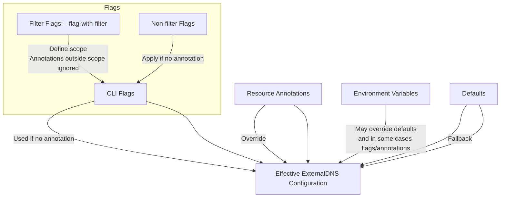

## Annotations vs. CLI Flags Precedence

ExternalDNS configuration can come from three sources: resource annotations, CLI flags, environment variables, and defaults.
The effective value is determined by the following precedence order:

1. **Annotations**
   - Most configuration options can be set via annotations on supported resources.
   - When present, annotations override the corresponding CLI flags and defaults.
     - Exception: should be documented.
     - Exception: ignored when applied to `kind: DNSEndpoint`
     - Exception: filter flags (e.g. `--service-type-filter`, `--source`) define the *scope* of resources considered.

2. **CLI Flags**
   - Non-filter flags apply if no annotation overrides them.
   - Filter flags (`--source`, `--service-type-filter`, `--*-filter`) limit which resources are processed.
     - Annotations outside the defined scope are ignored.
     - If a resource is excluded by a filter, annotations configured on the resource or defaults will not be applied.

3. **Environment Variables**
   - May override defaults, and in some cases may take precedence over CLI flags and annotations.
   - Behavior depends on how the variable is mapped in the code. Where or not it replicates CLI flag or provider specific. Example: `kubectl` or `cloudflare`.

4. **Defaults**
   - If none of the above specify a value, ExternalDNS falls back to its defaults.
