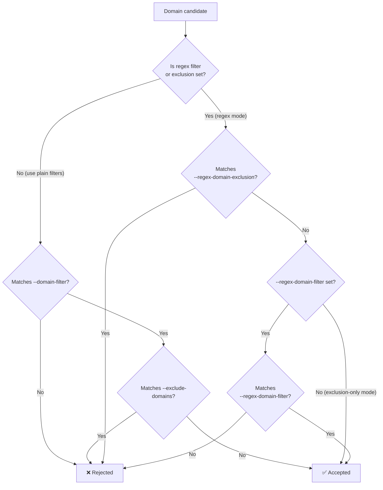

# Domain Filter

ExternalDNS provides four flags for controlling which domains it manages:

| Flag | Semantics |
|---|---|
| `--domain-filter` | Suffix match — includes a domain and all its subdomains |
| `--exclude-domains` | Suffix match — excludes a domain or subdomain from `--domain-filter` |
| `--regex-domain-filter` | Full regex match — **overrides `--domain-filter`** when set |
| `--regex-domain-exclusion` | Regex that subtracts matches from `--regex-domain-filter`; can also be used standalone |

Both flags are applied to DNS record names. Providers that partition zones before managing records
(e.g. PowerDNS) also apply the filter to zone names.

When either regex flag is set, **it takes complete precedence** — `--domain-filter` and
`--exclude-domains` are ignored entirely.

## Plain domain filter

Specify one or more domain suffixes. ExternalDNS will manage any record whose name ends with one of
the provided values.

```sh
--domain-filter=example.com
--domain-filter=other.org
```

To exclude specific subdomains use `--exclude-domains`:

```sh
--domain-filter=example.com
--exclude-domains=staging.example.com
```

## Regex domain filter

`--regex-domain-filter` accepts a Go RE2 regular expression. Use it when suffix matching is not
expressive enough — for example, to select zones by region name pattern.

```sh
--regex-domain-filter='\.org$'
```

Use `--regex-domain-exclusion` to reject zones that would otherwise match:

```sh
--regex-domain-filter='^([\w-]+\.)*example\.com$'
--regex-domain-exclusion='^staging\.'
```

### Matching logic

Exclusion is always checked first:

1. If `--regex-domain-exclusion` matches → **rejected**
2. If `--regex-domain-filter` matches → **accepted**
3. If only `--regex-domain-exclusion` is set and the domain did not match → **accepted** (exclusion-only mode)
4. If `--regex-domain-filter` is set but does not match → **rejected**



### Examples

**Include only `.org` domains:**

```sh
--regex-domain-filter='\.org$'
```

**Include a specific set of domains:**

```sh
--regex-domain-filter='(?:foo|bar)\.org$'
```

**Include with exclusion:**

```sh
# foo.org, bar.org, a.example.foo.org → accepted
# example.foo.org, example.bar.org    → rejected
--regex-domain-filter='(?:foo|bar)\.org$'
--regex-domain-exclusion='^example\.(?:foo|bar)\.org$'
```

**Production environment with temp exclusion:**

```sh
--regex-domain-filter='\.prod\.example\.com$'
--regex-domain-exclusion='^temp-'
```

**Exclusion-only (accept everything except a pattern):**

```sh
--regex-domain-exclusion='test-v1\.3\.example-test\.in'
```

**Exclude a complex pattern:**

```sh
--regex-domain-exclusion='^(internal|private)-.*\.example\.com$'
```

### Zone-partitioning pitfall: `+` vs `*`

The most common misconfiguration when filtering zones (not just records) is using `[\w-]+` (one or
more) instead of `([\w-]+\.)*` (zero or more) for the label-prefix group. Because `+` requires at
least one repetition:

- The **apex zone** (`example.com`) has no label prefix and will never match.
- **Multi-label subdomain zones** (`long.sub.example.com`) contain dots that `[\w-]+` cannot span.

Both zone types end up unmanaged, causing ExternalDNS to log `Ignoring Endpoint` for every record
they contain with no other indication of what went wrong.

| Regex | Matches | Misses |
|---|---|---|
| `^[\w-]+\.example\.com$` | `sub.example.com` | `example.com`, `long.sub.example.com` |
| `^([\w-]+\.)*example\.com$` | `example.com`, `sub.example.com`, `long.sub.example.com` | — |

Always use `*` so the apex matches on zero repetitions and deeper zones match on two or more.

### Multi-region example

```sh
--regex-domain-filter='^([\w-]+\.)*(?:us-east-1|eu-central-1)\.example\.com$'
--regex-domain-exclusion='^staging\.'
```

| Zone | Result |
|---|---|
| `us-east-1.example.com` | managed |
| `prod.us-east-1.example.com` | managed |
| `eu-central-1.example.com` | managed |
| `staging.us-east-1.example.com` | excluded |
| `other.com` | not managed |

## Notes

- **Regex syntax**: Standard Go RE2. Escape dots (`\.`) and use anchors (`^`, `$`) where precision matters.
- **Case sensitivity**: Matching is case-sensitive. Domains are lowercased and trailing dots stripped before matching.
- **IDN / Unicode**: Domains are converted to Unicode form (IDNA) before matching, so patterns against emoji or Unicode labels work as expected.
- **Mutual exclusivity**: Once a regex flag is non-empty, list-based filters are ignored entirely.

## Debugging

If records are silently dropped, look for `Ignoring Endpoint` in the logs — this means no managed
zone matched the record. To isolate whether the domain filter is the cause, temporarily switch to
`--domain-filter` with the plain suffix; if records reappear, the regex is the problem.

## Testing your regex

Before deploying, validate the regex against real zone names:

- [regex101.com](https://regex101.com/) — interactive tester; select the **Golang** flavour to match Go's RE2 engine exactly. Paste each zone name on a separate line and enable the **global** flag.
- AI assistants (ChatGPT, Claude, Gemini, etc.) — describe the zones you want to match/exclude and ask for a regex; always verify the output in regex101 before use.

## See Also

- [Flags reference](../flags.md) — `--domain-filter`, `--exclude-domains`, `--regex-domain-filter`, `--regex-domain-exclusion`
- [AWS filters tutorial](../tutorials/aws-filters.md) — filter flag interaction table
- [FAQ](../faq.md) — general configuration questions
