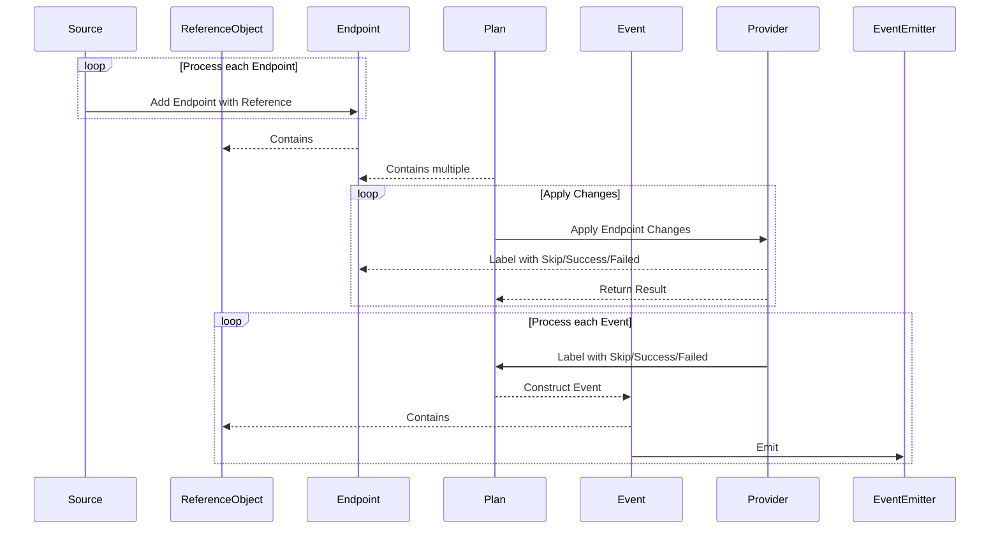

# Kubernetes Events in External-DNS

External-DNS manages DNS records dynamically based on Kubernetes resources like Services and Ingresses.
Emitting Kubernetes Events provides a lightweight observable way for users and systems to understand what External-DNS is doing, especially in production environments where DNS correctness is essential.

> Note; events is currently alpha feature. Functionality is limited and subject to change

## ✨ Why Events Matter

Kubernetes Events enable External-DNS to provide real-time feedback to users and controllers, complementing logs with a simpler way to track DNS changes. This enhances debugging, monitoring, and automation around DNS operations.

### Use Cases of Emitting Events

| Use Case                                          | Description                                                                                                  |
|---------------------------------------------------|--------------------------------------------------------------------------------------------------------------|
| **DNS Record Visibility**                         | Events show what DNS records were created, updated, or deleted (e.g., `Created A record "api.example.com"`). |
| **Developer Feedback**                            | Users deploying Ingresses or Services can see if External-DNS processed their resource.                      |
| **Surface Errors, Debugging and Troubleshooting** | Easily identify resource misannotations, sync failures, or IAM permission issues.                            |
| **Error Reporting**                               | Emit warning events when record sync fails due to provider issues, duplicate records, or misconfigurations.  |
| **Integration with Alerting/Automation/Auditing** | This enables automated remediation or notifications when DNS sync fails or changes unexpectedly.             |
| **Observability**                                 | Trace why a DNS record wasn’t created.                                                                       |
| **Alerting/automation**                           | Trigger actions based on failed events.                                                                      |
| **Operator and Developer feedback**               | It removes the black-box feeling of "I deployed an Ingress, but why doesn’t the DNS work?"                   |

## Consuming Events

You can observe External-DNS events using:

```sh
kubectl describe service <name>
kubectl get events --field-selector involvedObject.kind=Service
kubectl get events --field-selector type=Normal|Warning
kubectl get events --field-selector reason=RecordReady|RecordDeleted|RecordError
```

Or integrate with tools like:

- Prometheus (via event exporters)
- Loki/Fluentd for log/event aggregation
- Argo CD / Flux for GitOps monitoring

### Practices for Understanding Events

- **Action field**: Events include a short label describing the `Action`, such as `Created`, `Updated`, `Deleted`, or `FailedSync`
- **Reason field**: Events include a short label `Reason` is why the action was taken, such as `RecordReady`, `RecordDeleted`, or `RecordError`.
- **Type field**:
  - `Normal` means the operation succeeded (e.g., a DNS record was created).
  - `Warning`  indicates a problem (e.g., DNS sync failed due to configuration or provider issues).
- **Linked** resource: Events are attached to the relevant Kubernetes resource (like an `Ingress` or `Service`), so you can view them with tools like `kubectl describe`.
- **Event noise**: If you see repeated identical events, it may indicate a misconfiguration or an issue worth investigating.

### Sequence Overview: External-DNS Endpoint Reconciliation and Event Emission

The following sequence diagram illustrates the core workflow of how External-DNS processes endpoints, applies DNS changes, and emits Kubernetes events:

1. **Endpoint Collection**
   The `Source` component generates `Endpoint` objects, each linked to a `ReferenceObject` (such as a Service or Ingress).

2. **Plan Construction**
   A `Plan` aggregates multiple `Endpoints` and prepares a list of desired DNS changes.

3. **Change Application**
   The `Plan` sends the changes to a DNS `Provider`, which attempts to apply them. Each `Endpoint` is labeled with the result: `Success`, `Failed`, or `Skip`.

4. **Event Emission**
   Based on the result, an `Event` is created for each `Endpoint`, referencing the original `ReferenceObject`. These events are then emitted via the `EventEmitter`.

This sequence ensures DNS records are managed declaratively and provides real-time visibility into the system’s behavior through Kubernetes Events.



### Caveats

- Events are ephemeral (default retention is ~1 hour).
- They are best-effort and not guaranteed to be delivered or stored long-term.
- Not a substitute for logging or metrics, but complementary.

## Supported Sources

Events are emitted for all sources that External-DNS supports. The following table lists the sources and whether they currently emit events.
If a source does not emit events, it may in the future.

| Source                 | Supported |
|:-----------------------|:---------:|
| `ambassador-host`      |           |
| `cloudfoundry`         |           |
| `connector`            |           |
| `contour-httpproxy`    |           |
| `crd`                  |           |
| `empty`                |           |
| `f5-transportserver`   |           |
| `f5-virtualserver`     |           |
| `fake`                 |     ✅     |
| `gateway-grpcroute`    |           |
| `gateway-httproute`    |           |
| `gateway-tcproute`     |           |
| `gateway-tlsroute`     |           |
| `gateway-udproute`     |           |
| `gloo-proxy`           |           |
| `ingress`              |           |
| `istio-gateway`        |           |
| `istio-virtualservice` |           |
| `kong-tcpingress`      |           |
| `node`                 |           |
| `openshift-route`      |           |
| `pod`                  |           |
| `service`              |           |
| `skipper-routegroup`   |           |
| `traefik-proxy`        |           |
