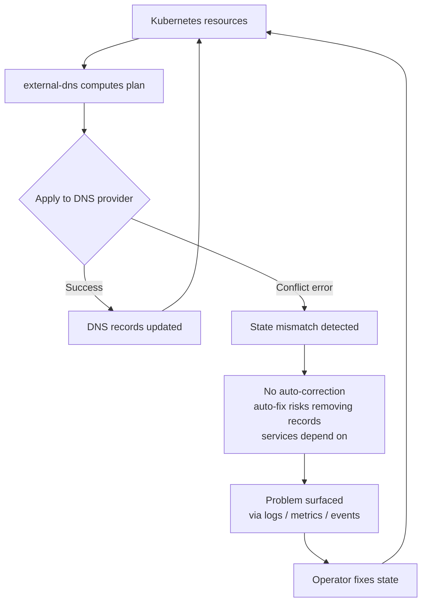
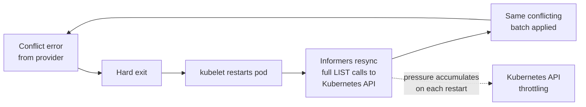

---
tags:
  - advanced
  - operations
  - performance
  - configuration
---

# Operational Best Practices

This guide covers configuration recommendations for running external-dns reliably in production.
It focuses on the interaction between flags and real-world deployment scenarios — scope, memory,
scale, and observability — and complements the per-feature reference pages linked throughout.

> If you have operational experience or best practices not covered here, please open a proposal
> PR to share it with the community.

## Production Readiness Checklist

Use this as a quick review before deploying to production. Each item links to the relevant
section below.

**Resource scope**

- [ ] Set [`--service-type-filter`](#reducing-the-informer-scope) to only the service types you
  actually publish (e.g., `LoadBalancer`). The default watches Pods, EndpointSlices, and Nodes
  unnecessarily for most deployments.
- [ ] Add [`--label-filter` or `--annotation-filter`](#reducing-the-informer-scope) to further
  limit which objects are cached.

**Source configuration**

- [ ] Only configure [`--source=`](#source-configuration-and-preflight-validation) types whose
  CRDs are fully installed and established on the cluster. A missing CRD does not always produce
  a clear error — it can manifest as a `context deadline exceeded` timeout or silent informer
  staleness.
- [ ] Grant RBAC `list` **and** `watch` for every resource type each configured source requires.
  A missing `watch` permission lets external-dns start cleanly but freezes its view of the
  cluster — DNS records drift silently with no crash and no log warning.
- [ ] Scope RBAC to only the sources that are configured. Excess permissions hide misconfiguration
  rather than surfacing it.
- [ ] In multi-cluster deployments, use per-cluster source lists rather than a shared
  configuration.
- [ ] Validate against a staging environment that mirrors production CRD and RBAC profiles before
  rolling out changes.

**Scaling**

- [ ] Scope resources at every level — service type, label, annotation, domain, zone ID. See
  [Scope resources](#scope-resources).
- [ ] Split into multiple instances for large zone sets or source mixes, each with a distinct --txt-owner-id` and non-overlapping domain scope. See [Split instances](#split-instances).
- [ ] Tune reconcile frequency and raise `--kube-api-request-timeout` on large clusters. See [Reduce reconcile pressure](#reduce-reconcile-pressure).
- [ ] Set `--kube-api-qps` and `--kube-api-burst` if external-dns is throttled by the Kubernetes API or shares API quota with many other controllers. See [Reduce reconcile pressure](#reduce-reconcile-pressure).

**Observability**

- [ ] Alert on [`external_dns_controller_consecutive_soft_errors`](#key-metrics) greater than 0
  for more than one reconcile cycle.
- [ ] Alert on a sustained increase in [`external_dns_source_errors_total`](#key-metrics) or
  [`external_dns_registry_errors_total`](#key-metrics).
- [ ] Enable [`--events-emit=RecordError`](#kubernetes-events-for-invalid-endpoints) to surface
  misconfigured endpoints on the responsible Kubernetes resource.

**Registry and ownership**

- [ ] Set a unique `--txt-owner-id` per external-dns instance and avoid overlapping
  `--domain-filter` scopes. Multiple instances writing to the same zone without distinct owner
  IDs can produce conflict errors and, if a conflict causes a hard exit, a crashloop.
  See [State Conflicts and Ownership](#state-conflicts-and-ownership).

**Provider**

- [ ] Configure batch change size and interval for your provider if you manage large or
  frequently-changing zones. See [DNS provider API rate limits](rate-limits.md) for per-provider
  flags.
- [ ] Enable zone caching if your provider supports it. Zone enumeration is an API call on
  every reconcile; caching it reduces provider API pressure significantly for stable zone sets.
  See [Zone caching](#zone-list-caching) for supported providers and flags.
- [ ] Scope provider credentials (API keys, IAM roles) to only the zones external-dns manages.
  Zone filtering flags express intent but are not an enforcement boundary — the credentials are.
  See [Scope provider credentials to specific zones](#scope-provider-credentials-to-specific-zones).

---

## Resource Scope and Memory

### The service source watches more than just Services

By default the `service` source registers Kubernetes informers for **Services, Pods, EndpointSlices,
and Nodes**. Which informers are active depends on the service types in scope:

| Active informers      | Triggered when                                  |
|:----------------------|:------------------------------------------------|
| Services              | Always                                          |
| Pods + EndpointSlices | `NodePort` or `ClusterIP` services are in scope |
| Nodes                 | `NodePort` services are in scope                |

With no `--service-type-filter` set (the default), all service types are in scope and all four
informers are started. On large clusters this has two consequences:

1. **Steady-state memory**: external-dns holds an in-memory cache of every Pod, EndpointSlice,
   and Node in the cluster — not only the ones relevant to DNS.
2. **Startup memory burst**: the classic Kubernetes LIST code path fetches all objects of a type
   into memory at once during initial informer sync. A Pod transformer is applied
   ([`source/service.go:159`](../../source/service.go)) to reduce stored size, but as the comment
   there notes:
   > "If watchList is not used it will not prevent memory bursts on the initial informer sync."

### Reducing the informer scope

The most effective mitigation is to restrict the service types external-dns watches:

```sh
# Most clusters only need LoadBalancer — eliminates Pod, EndpointSlice, and Node informers entirely
--service-type-filter=LoadBalancer
```

Combine with label or annotation filters to further limit the set of Service objects listed:

```sh
--label-filter=external-dns/enabled=true
--annotation-filter=external-dns.alpha.kubernetes.io/hostname
```

The table below shows which informers are eliminated by `--service-type-filter`:

| Filter value                | Informers removed                 |
|:----------------------------|:----------------------------------|
| `LoadBalancer`              | Pods, EndpointSlices, Nodes       |
| `LoadBalancer,ExternalName` | Pods, EndpointSlices, Nodes       |
| `ClusterIP`                 | Nodes                             |
| `NodePort`                  | *(none — all informers required)* |

> **Note:** The informer scope reduction is a side-effect of type filtering, not its primary
> purpose. Always choose filters based on what DNS records you actually need to publish; the
> memory reduction is a bonus.

### Reducing startup memory bursts

The memory burst during initial sync is a known limitation of the classic LIST code path in
`client-go`. A streaming alternative called **WatchList** (`WatchListClient` feature gate) avoids
the burst by receiving objects one-at-a-time via a Watch with `SendInitialEvents=true` rather than
fetching all objects at once.

The `WatchListClient` feature gate defaults to `true` in recent versions of client-go, so the
burst is effectively eliminated when running the latest release of external-dns. On older
releases, `--service-type-filter` is the primary mitigation. **Use the latest release.**

> **Note:** Even with WatchList enabled, transformers and indexers on all informer types are
> needed to reduce steady-state memory. Work is ongoing to add them consistently across sources.

## Source Configuration and Preflight Validation

External-dns fails fast when a configured source cannot initialize — **this is intentional.**
A crashloop is a clear, explicit signal that the configuration is wrong. Silently skipping a
broken source would mask the problem and make failures much harder to diagnose.

Production safety should come from correct configuration and preflight validation, not from
external-dns guessing what the user meant.

### Failure modes are not always obvious

The difficulty is that RBAC problems and missing CRDs do not always surface as a clean, explicit
error. Depending on what is misconfigured, the failure mode can be a timeout, an empty result,
or silent staleness rather than a crash:

| Misconfiguration                 | Typical symptom                                            | Why it's subtle                                                                                       |
|:---------------------------------|:-----------------------------------------------------------|:------------------------------------------------------------------------------------------------------|
| CRD not installed                | `context deadline exceeded` after ~60s                     | Informer blocks waiting for cache sync; no "CRD not found" message                                    |
| No LIST permission               | `403 Forbidden` → exit                                     | Usually clean, but error may reference an internal API path that is hard to map back to the source    |
| LIST allowed, WATCH denied       | Informer starts, never receives updates                    | DNS records appear stale; no crash, no error logged after startup                                     |
| Admission webhook misconfigured  | Source initializes successfully, changes silently rejected | External-dns sees no error; records are never created or updated                                      |

The LIST-without-WATCH case is particularly dangerous: external-dns starts cleanly, reports
healthy, but its view of the cluster is frozen at the point of last successful LIST. DNS records
will drift from actual cluster state without any indication in logs or metrics.

### Practices

**Explicitly scope enabled sources.**
Only configure `--source=` types that are fully supported on the target cluster — the right CRDs
installed, RBAC granted, and any admission webhooks configured. Do not rely on any form of
best-effort or graceful degradation.

```sh
# Configure only what is present and authorized on this cluster
--source=service
--source=ingress
```

**Install CRDs before enabling dependent sources.**
For sources that depend on custom resources (Gateway API, Istio, CRD source), install the CRDs
and verify they are established (`kubectl get crd <name>` shows `ESTABLISHED`) before adding the
corresponding `--source=` flag. A missing CRD does not always produce a "not found" error — it
can cause the informer cache sync to block and time out, surfacing as a generic `context deadline
exceeded` at startup with no indication of which CRD is missing.

**Use per-cluster source lists in multi-cluster deployments.**
When managing clusters with different CRD profiles via Helm or ArgoCD, define source lists per
cluster rather than sharing a single configuration. A value that works on a cluster with Gateway
API installed will crash-loop on one without it.

```yaml
# values-cluster-a.yaml  (Gateway API installed)
sources:
  - service
  - gateway-httproute

# values-cluster-b.yaml  (no Gateway API)
sources:
  - service
  - ingress
```

**Validate configuration early — fail in CI, not in production.**
Add a startup check to your CI or pre-deployment pipeline using `--dry-run --once` against a
staging cluster that mirrors the production CRD and RBAC profile. `--once` alone will apply real
DNS changes; always pair it with `--dry-run` for validation. A crash in staging is cheap; a
crashloop in production affects DNS for all managed records until the pod restarts.

**Use minimal RBAC.**
Grant external-dns only the API access it needs for the configured sources. Excess permissions
are a security concern: if a source is accidentally added to the configuration, external-dns
will silently start watching resources it was never intended to manage. Insufficient permissions
for a configured source cause a crash on startup, which is the intended signal — but only if
RBAC is scoped tightly enough to surface it.

## Scaling on Large Clusters

Scaling external-dns comes down to three principles applied in combination:

### Scope resources

The fewer Kubernetes objects external-dns watches and the fewer DNS zones it manages, the lower
its steady-state memory, API call volume, and reconcile duration. Apply filters at every
available level — service type, label, annotation, domain, and zone ID.

See [Resource Scope and Memory](#resource-scope-and-memory) and
[Domain Filter](domain-filter.md) for details.

### Split instances

A single external-dns instance managing a large number of zones or sources will have a large
reconcile surface and long reconcile cycles. Splitting into multiple instances — each responsible
for a distinct zone set, namespace, or source type — reduces per-instance load and makes
failures smaller in blast radius.

Each instance must have a distinct `--txt-owner-id` and non-overlapping `--domain-filter` or
`--zone-id-filter` scopes to avoid ownership conflicts. See
[State Conflicts and Ownership](#state-conflicts-and-ownership).

### Reduce reconcile pressure

Tune reconcile frequency to match your actual change rate rather than running at the default
interval. Use event-driven reconciliation to react quickly to real changes while keeping
background polling infrequent. Raise `--kube-api-request-timeout` if individual Kubernetes API
calls time out on a slow or heavily loaded API server (the default is 30s per request).

**Kubernetes API rate limiting.** external-dns inherits client-go's built-in defaults of 5 QPS
and 10 burst for Kubernetes API calls. On clusters where external-dns manages many sources or
runs at a high reconcile frequency, these defaults can be too low, causing throttling. On
clusters where it shares API quota with many other controllers, they may need to be lowered to
avoid starving higher-priority controllers.

```sh
# Raise limits for a high-throughput instance managing many sources
--kube-api-qps=20
--kube-api-burst=40

# Lower limits for a low-priority instance on a busy cluster
--kube-api-qps=2
--kube-api-burst=5
```

When the limit is hit, external-dns logs an error containing
`consider raising --kube-api-qps/--kube-api-burst` to make the cause actionable. Both flags
default to the client-go built-in values (5 QPS / 10 burst) when not set.

For per-provider flags covering batch change sizing, record caching, and zone list caching, see
[DNS provider API rate limits](rate-limits.md) and [Provider Notes](#provider-notes).

## Observability

### Key metrics

The following metrics are the first place to look when diagnosing operational problems:

| Metric                                             | When to alert                                                       |
|:---------------------------------------------------|:--------------------------------------------------------------------|
| `external_dns_controller_consecutive_soft_errors`  | > 0 for more than one reconcile cycle                               |
| `external_dns_source_errors_total`                 | Sustained increase (Kubernetes API errors from informers)           |
| `external_dns_registry_errors_total`               | Any increase (TXT / DynamoDB registry failures)                     |
| `external_dns_controller_verified_records`         | Unexpected drop (records no longer owned by this instance)          |

See [Available Metrics](../monitoring/metrics.md) for the full list.

> **Future:** Work is in progress to add an `external_dns_source_invalid_endpoints` gauge
> (partitioned by `record_type` and `source_type`) that resets and refills each reconcile cycle,
> making it straightforward to alert on dropped endpoints without log grepping. Until that lands,
> watch `external_dns_source_errors_total` and enable `--events-emit=RecordError` (see below).

### Kubernetes Events for invalid endpoints

Invalid endpoints — CNAME self-references, malformed MX/SRV records, unsupported alias types —
are silently dropped by the dedup layer with only a log warning at default log levels. Without
structured observability, the only way to discover them is to grep logs.

Enable `RecordError` events to surface invalid endpoints directly on the responsible Kubernetes
resource:

```sh
--events-emit=RecordError
```

```sh
# Inspect invalid endpoints across the cluster
kubectl get events --field-selector reason=RecordError

# Or scoped to a specific resource
kubectl describe ingress my-ingress
```

See [Kubernetes Events in External-DNS](events.md) for full documentation and the list of
supported event types.

## State Conflicts and Ownership

External-dns detects desired vs. current state, computes a plan, and applies it — assuming the
plan is internally consistent. When a provider returns a conflict error (HTTP 409 or equivalent),
it means the current DNS state does not match what external-dns expects. **This is a state
problem, not a software bug.** The correctness of annotations and desired state is the
operator's responsibility. External-dns cannot auto-correct user-defined configuration: any
automated correction risks removing or replacing DNS records that services depend on, making
those services unreachable. Instead, external-dns does its best to make these problems visible
so operators can fix them deliberately. It has no general conflict-resolution policy: it drops
some well-known invalid records (such as CNAME self-references), but does not apply a subset,
auto-correct arbitrary conflicts, or attempt partial best-effort behavior. Retrying the same
request without changing the input or reconciling the external state will deterministically fail.



**Crashloop amplification.** A hard error that causes external-dns to exit leads to a crashloop:
kubelet restarts the pod, informers resync with full LIST calls to the Kubernetes API for every
watched resource type (Services, Pods, EndpointSlices, Nodes), and the same conflicting batch is
attempted again. Each restart repeats the cycle, progressively increasing LIST traffic against
the Kubernetes API server. On large clusters or at high restart frequency this can contribute to
Kubernetes API throttling that affects other controllers and workloads — not just external-dns.



A hard error that kills the process does not increment `external_dns_controller_consecutive_soft_errors`
— that metric tracks soft errors only. Monitor pod restarts via
`kube_pod_container_status_restarts_total` and alert on crashloop backoff (`CrashLoopBackOff`
status) to catch this early.

**When you observe conflict errors, fix the state:**

- Ensure a single external-dns instance owns each zone or record set. When using the TXT or
  DynamoDB registry, use a distinct `--txt-owner-id` per instance and avoid overlapping
  `--domain-filter` scopes.
- Remove or update conflicting records in the DNS provider directly.
- Review annotations and desired state for invalid record definitions — for example, mixing CNAME
  with A/AAAA records for the same hostname, or a CNAME that points to itself.
- Check for other controllers or automation writing to the same zone.
- If the environment is in an inconsistent state during a migration or incident, scale
  external-dns to zero until the state is reconciled, then scale it back up.

> **Visibility:** Work is ongoing to make state problems as visible as possible before they
> become incidents. Planned improvements include per-record-type metrics for rejected endpoints
> and Kubernetes Events emitted directly on the responsible resource, so operators can alert on
> conflicts without grepping logs. If you encounter a conflict or misconfiguration that is not
> surfaced by existing metrics or events, please open an issue or submit a PR.

## Provider Notes

### Zone list caching

On every reconcile, external-dns calls the provider API to enumerate the zones it is allowed to
manage. For accounts with many zones, or providers with strict API rate limits, this enumeration
can be a significant source of API traffic even when no DNS records are changing.

Several providers support a zone list cache that stores the zone list in memory for a configurable
TTL and re-fetches only after it expires. Set the TTL to reflect how often your zone list
actually changes — for most deployments zones are added or removed rarely, so a value of `1h` or
longer is appropriate.

> **Note:** Zone list caching is distinct from record caching (`--provider-cache-time`), which
> caches the DNS records within a zone. Both can be used together. See
> [DNS provider API rate limits](rate-limits.md) for per-provider flags.

### Scope provider credentials to specific zones

Provider API keys or IAM roles should be scoped to only the zones external-dns is expected to
manage. Granting access to all zones in an account has two consequences:

- **Operational:** external-dns will enumerate and potentially modify every zone the credentials
  can reach. A misconfigured filter or a missing `--txt-owner-id` can cause unintended changes
  to zones outside the intended scope.
- **Security:** a credential leak exposes every zone in the account, not just the ones
  external-dns manages.

Zone filtering flags express application-level intent and reduce API call volume, but they are
not an enforcement boundary — the credentials are. See [Domain Filter](domain-filter.md) for
details.

### Batch API

For zones with frequent or large change sets, individual per-record API calls can exhaust
provider rate limits quickly. Where supported, a batch API significantly reduces call volume.
The exact reduction varies by provider, but the general pattern is:

| Approach   | API calls per sync                              |
|:-----------|:------------------------------------------------|
| Individual | Grows linearly with number of records changed   |
| Batch      | Grows with number of batches, not record count  |

When a batch submission fails (e.g., one record in the batch is misconfigured), providers
typically fall back to individual per-record calls for that sync cycle, so a single bad record
does not block DNS updates for the rest of the zone. See
[DNS provider API rate limits](rate-limits.md) for per-provider batch flags.

## See Also

- [Flags reference](../flags.md) — complete flag listing with defaults
- [DNS provider API rate limits](rate-limits.md) — batch sizing, provider cache, and rate-limit tuning
- [Domain Filter](domain-filter.md) — domain and zone filtering, and the credential boundary distinction
- [Kubernetes Events in External-DNS](events.md) — event types, sources, and consumption
- [Available Metrics](../monitoring/metrics.md) — full metrics reference
