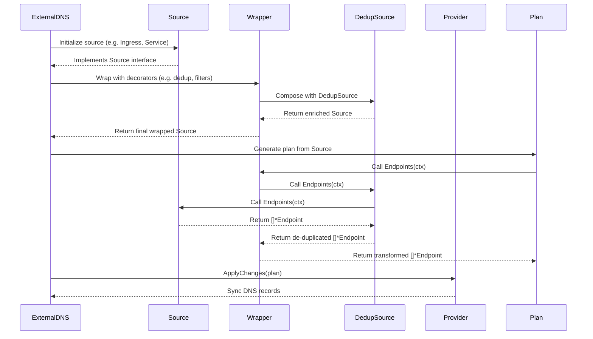

# 🧩 Source Wrappers/Middleware

## Overview

In ExternalDNS, a **Source** is a component responsible for discovering DNS records from Kubernetes resources (e.g., `Ingress`, `Service`, `Gateway`, etc.).

**Source Wrappers** are middleware-like components that sit between the source and the plan generation. They extend or modify the behavior of the original sources by transforming, filtering, or enriching the DNS records before they're processed by the planner and provider.

---

## Why Wrappers?

Wrappers solve these key challenges:

- ✂️ **Filtering**: Remove unwanted targets or records from sources based on labels, annotations, targets and etc.
- 🔗 **Aggregation**: Combine Endpoints from multiple underlying sources. For example, from both Kubernetes Services and Ingresses.
- 🧹 **Deduplication**: Prevent duplicate DNS records across sources.
- 🌐 **Target transformation**: Rewrite targets for IPv6 networks or alter endpoint attributes like FQDNS or targets.
- 🧪 **Testing and simulation**: Use the `FakeSource` or wrappers for dry-runs or simulations.
- 🔁 **Composability**: Chain multiple behaviors without modifying core sources.
- 🔐 **Access Control**: Limits endpoint exposure based on policies or user access.
- 📊 **Observability**: Adds logging, debugging, or metrics around source behavior.

---

## Built In Wrappers

|       Wrapper        | Purpose                                 | Use Case                              |
|:--------------------:|:----------------------------------------|:--------------------------------------|
|    `MultiSource`     | Combine multiple sources.               | Aggregate `Ingress`, `Service`, etc.  |
|    `DedupSource`     | Remove duplicate DNS records.           | Avoid duplicate records from sources. |
| `TargetFilterSource` | Include/exclude targets based on CIDRs. | Exclude internal IPs.                 |
|    `NAT64Source`     | Add NAT64-prefixed AAAA records.        | Support IPv6 with NAT64.              |

### Use Cases

### 1.1 `TargetFilterSource`

Filters targets (e.g. IPs or hostnames) based on inclusion or exclusion rules.

📌 **Use case**: Only publish public IPs, exclude test environments.

```yaml
--target-net-filter=192.168.0.0/16
--exclude-target-nets=10.0.0.0/8
```

### 2.1 `NAT64Source`

Converts IPv4 targets to IPv6 using NAT64 prefixes.

📌 **Use case**: Publish AAAA records for IPv6-only clients in NAT64 environments.

```yaml
--nat64-prefix=64:ff9b::/96
```

---

## How Wrappers Work

Wrappers wrap a `Source` and implement the same `Source` interface (e.g., `Endpoints(ctx)`).

They typically follow this pattern:

```go
package wrappers

type myWrapper struct {
	next source.Source
}

func (m *myWrapper) Endpoints(ctx context.Context) ([]*endpoint.Endpoint, error) {
	eps, err := m.next.Endpoints(ctx)
	if err != nil {
		return nil, err
	}

	// Modify, filter, or enrich endpoints as needed
	return eps, nil
}

// AddEventHandler must be implemented to satisfy the source.Source interface.
func (m *myWrapper) AddEventHandler(ctx context.Context, handler func()) {
	log.Debugf("myWrapper: adding event handler")
	m.next.AddEventHandler(ctx, handler)
}
```

This allows wrappers to be stacked or composed together.

---

### Composition of Wrappers

Wrappers are often composed like this:

```go
source := NewMultiSource(actualSources, defaultTargets)
source = NewDedupSource(source)
source = NewNAT64Source(source, cfg.NAT64Networks)
source = NewTargetFilterSource(source, targetFilter)
```

Each wrapper processes the output of the previous one.

---

## High Level Design

- Source: Implements the base logic for extracting DNS endpoints (e.g. IngressSource, ServiceSource, etc.)
- Wrappers: Decorate the source (e.g. DedupSource, TargetFilterSource) to enhance or filter endpoint data
- Plan: Compares the endpoints from Source with DNS state from Provider and produces create/update/delete changes
- Provider: Applies changes to actual DNS services (e.g. Route53, Cloudflare, Azure DNS)



## Learn More

- [Source Interface](https://github.com/kubernetes-sigs/external-dns/blob/master/source/source.go)
- [Wrappers Source Code](https://github.com/kubernetes-sigs/external-dns/tree/master/source/wrappers)
