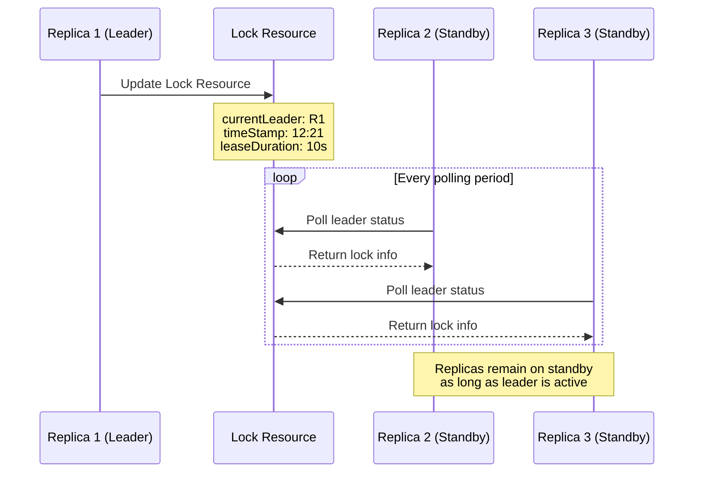
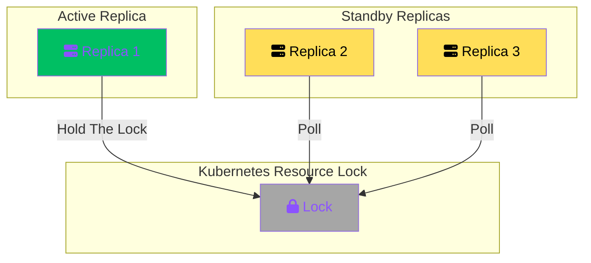
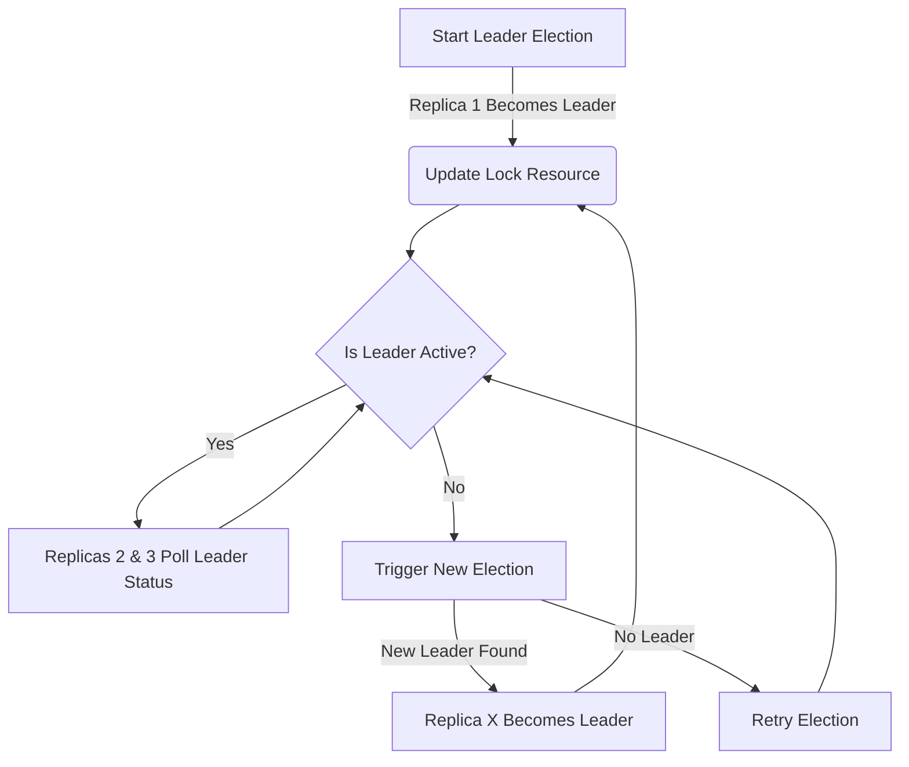

```yaml
---
title: leader election proposal
version: 0.15.1
authors: @ivankatliarchuk
creation-date: 2025-jan-30
status: not-planned
---
```

# Leader Election

In Kubernetes, **leader election** is a mechanism used by applications, controllers, or distributed systems to designate one instance or node as the "leader" that is responsible for managing specific tasks, while others operate as followers or standbys.
This ensures coordinated and fault-tolerant operations in highly available systems.

- [Kubernetes Coordinated Leader Election](https://kubernetes.io/docs/concepts/cluster-administration/coordinated-leader-election/)
- [Kubernetes Concepts: Leases](https://kubernetes.io/docs/concepts/architecture/leases/)

## **Leader Election in Kubernetes**

The leader election mechanism implemented in Go code relies on Kubernetes coordination features, specifically Lease object in the `coordination.k8s.io` API Group. Lease locks provide a way to acquire a lease on a shared resource, which can be used to determine the leader among a group of nodes.

***Leader Election Sequence Diagram***



***Leader Election Flow***



***How Leader Is Elected***



### Enable Leader Election

Minimum supported Kubernetes version is `v1.26`.

> Currently, this feature is "opt-in". The `--enable-leader-election` flag must be explicitly provided to activate it in the service.

| **Flag**                   | **Description**                                       |
|:---------------------------|:------------------------------------------------------|
| `--enable-leader-election` | This flag is required to enable leader election logic |

```yml
args:
   --registry=txt \
   --source=fake \
   --enable-leader-election
```

## **How Leader Election Works in Kubernetes**

1. **Lease API**:
   - Kubernetes provides a built-in `Lease` object in the `coordination.k8s.io/v1` API group, specifically designed for leader election.
   - The leader writes a lease object with metadata (such as its identity and timestamp) to signal that it is the current leader.

2. **Election Process**:
   - All participating pods (or nodes) periodically check for the lease.
   - The lease contains details of the current leader's identity (e.g., a pod name).
   - If the lease expires or is not renewed, other contenders can try to acquire leadership by writing their identity into the lease object.

3. **Heartbeat (Lease Renewal)**:
   - The current leader must periodically update the lease to retain leadership.
   - If the leader fails to renew the lease within the configured timeout, leadership is relinquished, and another instance can take over.

---

### **Key Concepts**

- **Lease Duration**: Defines how long the leader is considered valid after the last lease renewal. Short lease durations result in faster failovers but higher contention and potential performance impact.
- **Leader Identity**: Usually the name or ID of the pod that holds the leadership role.
- **Backoff and Contention**: Followers typically wait and retry with a backoff period to avoid overwhelming the system when a leader is lost.

---

### **Why Leader Election is Important**

Leader election ensures that:

- **High Availability**: Fail-over to a new leader ensures availability even if the current leader goes down.
- **Data Consistency**: Only one leader acts on critical tasks, preventing duplicate work or conflicting updates.
- **Workload Distribution**: Secondary replicas can be on standby, reducing resource contention.

---

### **Use Cases**

Leader election functionality is critical for building reliable, fault-tolerant, and scalable applications on Kubernetes.

- **Cluster Upgrades**: Leader election ensures smooth cluster upgrades by designating one instance as responsible for orchestrating upgrades or managing specific components during the process.
By preventing multiple instances from making changes concurrently, it avoids conflicts and reduces downtime, ensuring consistency across the cluster.
- **Workload Running on Spot Instances**: For workloads running on cost-effective but ephemeral spot instances, leader election is crucial for resiliency.
When a spot instance running the leader is preempted, the failover process enables a standby instance to seamlessly take over leadership, ensuring continued execution of critical tasks.
- **Requirement for Disaster Recovery**: In disaster recovery scenarios, leader election provides fault tolerance by allowing another instance to take over when the primary leader becomes unavailable.
This guarantees operational continuity even in the face of unexpected failures, supporting robust disaster recovery strategies.
- **High Availability (HA) Scenarios**: In highly available systems, leader election ensures that a single active leader manages essential processes or state, while backups remain ready to step in instantly in case of failure.
This minimizes recovery time objectives (RTO) and eliminates single points of failure.
- **Enhanced Reliability in Distributed Systems**: Incorporating leader election into your distributed system enhances its overall reliability. It avoids the pitfalls of uncoordinated task execution, providing deterministic behavior and ensuring only one instance manages critical tasks at any given time.
- **Conflict Prevention**: Leader election serves as a guard against conflicts arising from multiple instances attempting to execute the same tasks. By ensuring that only the elected leader acts on shared resources or processes, it prevents data corruption, inconsistencies, and wasted computational effort.
