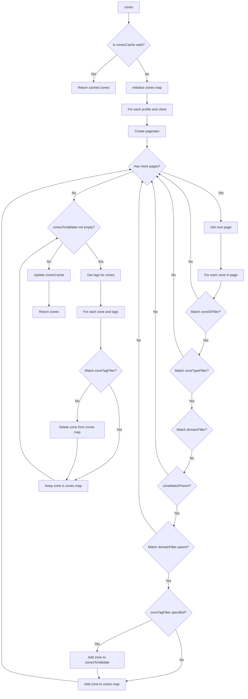
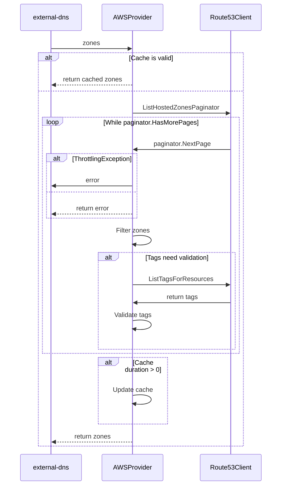

# AWS Filters

This document provides guidance on filtering AWS zones using various strategies and flags.

## Strategies for Scoping Zones

> Without specifying these flags, management applies to all zones.

In order to manage specific zones,  there is a possibility to combine multiple options

| Argument                   | Description                                                | Flow Control |
|:---------------------------|:-----------------------------------------------------------|:------------:|
| `--zone-id-filter`         | Specify multiple times if needed                           |      OR      |
| `--domain-filter`          | By domain suffix - specify multiple times if needed        |      OR      |
| `--regex-domain-filter`    | By domain suffix but as a regex - overrides domain-filter  |     AND      |
| `--exclude-domains`        | To exclude a domain or subdomain                           |      OR      |
| `--regex-domain-exclusion` | Subtracts its matches from `regex-domain-filter`'s matches |     AND      |
| `--aws-zone-type`          | Only sync zones of this type `[public\|private]`           |      OR      |
| `--aws-zone-tags`          | Only sync zones with this tag                              |     AND      |

Minimum required configuration

```sh
args:
    --provider=aws
    --registry=txt
    --source=service
```

### Filter by Zone Type

> If this flag is not specified, management applies to both public and private zones.

```sh
args:
    --aws-zone-type=private|public # choose between public or private
    ...
```

### Filter by Domain

> Specify multiple times if needed.

```sh
args:
    --domain-filter=example.com
    --domain-filter=.paradox.example.com
    ...
```

Example `--domain-filter=example.com` will allow for zone `example.com` and any zones that end in `.example.com`, including `an.example.com`, i.e., the subdomains of example.com.

When there are multiple domains, filter `--domain-filter=example.com` will match domains `example.com`, `ex.par.example.com`, `par.example.com`, `x.par.eu-west-1.example.com`.

And if the filter is prepended with `.` e.g., `--domain-filter=.example.com` it will allow *only* zones that end in `.example.com`, i.e., the subdomains of example.com but not the `example.com` zone itself. Example result: `ex.par.eu-west-1.example.com`, `ex.par.example.com`, `par.example.com`.

> Note: if you prepend the filter with ".", it will not attempt to match parent zones.

### Filter by Zone ID

> Specify multiple times if needed, the flow logic is OR

```sh
args:
    --zone-id-filter=ABCDEF12345678
    --zone-id-filter=XYZDEF12345888
    ...
```

### Filter by Tag

> Specify multiple times if needed, the flow logic is AND

Keys only

```sh
args:
    --aws-zone-tags=owner
    --aws-zone-tags=vertical
```

Or specify keys with values

```sh
args:
    --aws-zone-tags=owner=k8s
    --aws-zone-tags=vertical=k8s
```

Can't specify multiple or separate values with commas: `key1=val1,key2=val2` at the moment.
Filter only by value `--aws-zone-tags==tag-value` is not supported.

```sh
args:
    --aws-zone-tags=team=k8s,vertical=platform # this is not supported
    --aws-zone-tags==tag-value # this is not supported
```

## Filtering Workflows

***Filtering Sequence***

The diagram describes the sequence for filtering AWS zones.



***Filtering Flow***

The is a sequence diagram that describes the interaction between `external-dns`, `AWSProvider`, and `Route53Client`
during the filtering process. Here is a high-level description:


