# AWS and LocalStack

## Overview

This tutorial demonstrates how to configure ExternalDNS to manage DNS records in LocalStack's Route53 service using a local Kind (Kubernetes in Docker) cluster.

### TL;DR

After completing this lab, you will have a Kubernetes environment running as containers in your local development machine with localstack and external-dns.

## Prerequisite

Before you start, ensure you have:

- A running kubernetes cluster.
  - In this tutorial we are going to use [kind](https://kind.sigs.k8s.io/)
- [`kubectl`](https://kubernetes.io/docs/tasks/tools/) and [`helm`](https://helm.sh/)
- `external-dns` source code or [helm chart](https://github.com/kubernetes-sigs/external-dns/tree/master/charts/external-dns)
- `Localstack` how to [documenation](https://docs.localstack.cloud/)
- Optional
  - `AWS` [cli](https://aws.amazon.com/cli/)
  - `Localstack` [cli](https://docs.localstack.cloud/aws/getting-started/installation/)

## Architecture Overview

In this setup:

- `Kind` provides a local `Kubernetes` cluster
- `LocalStack` simulates AWS services (specifically `Route53`)
- `ExternalDNS` automatically creates DNS records in `LocalStack` based on `Kubernetes` resources

## Bootstrap Environment

### 1. Create cluster

```sh
kind create cluster --config=docs/snippets/tutorials/aws-localstack/kind.yaml

Creating cluster "aws-localstack" ...
 ✓ Preparing nodes 📦 📦
 ✓ Writing configuration 📜
 ✓ Starting control-plane 🕹️
 ✓ Installing CNI 🔌
 ✓ Installing StorageClass 💾
 ✓ Joining worker nodes 🚜
Set kubectl context to "kind-aws-localstack"
You can now use your cluster with:

kubectl cluster-info --context kind-aws-localstack
```

Verify the cluster is running:

```bash
kubectl cluster-info --context kind-aws-localstack
kubectl get nodes
```

### 2. Deploy Localstack

There are multiple options to configure etcd

1. With custom manifest.
2. Localstack [helm](https://docs.localstack.cloud/aws/integrations/containers/kubernetes/)

In this tutorial, we'll use the second option.

```sh
helm repo add localstack https://localstack.github.io/helm-charts
helm upgrade localstack localstack-charts/localstack \
  -n localstack \
  --create-namespace \
  --install \
  --atomic \
  --wait \
  -f docs/snippets/tutorials/aws-localstack/values-localstack.yml

❯❯ Release "localstack" does not exist. Installing it now.
```

Verify LocalStack is running

```sh
kubectl get pods -n localstack
kubectl logs deploy/localstack -n localstack
```

### 3: Create a Hosted Zone in LocalStack

Test if we could reach `Localstack`, `Route53` service is available and verify `Route53` zones created in localstack.

```sh
curl http://127.0.0.1:$NODE_PORT/_localstack/health | jq
docs/snippets/tutorials/aws-localstack/fetch-records.sh
```

Create extra hosted zones in localstack when required

```sh
export AWS_ACCESS_KEY_ID=test
export AWS_SECRET_ACCESS_KEY=test
export AWS_DEFAULT_REGION=us-east-1
export AWS_ENDPOINT_URL=http://127.0.0.1:32379

aws route53 create-hosted-zone \
  --name test.com \
  --caller-reference $(date +%s)
```

### 4. Configure ExternalDNS

Deploy with helm and minimal configuration.

Add the `external-dns` helm repository and check available versions

```sh
helm repo add external-dns https://kubernetes-sigs.github.io/external-dns/
helm repo update
helm search repo external-dns --versions
```

Install with required configuration

```sh
helm upgrade --install external-dns external-dns/external-dns \
  -n default \
  -f docs/snippets/tutorials/aws-localstack/values-extdns.yml

❯❯ Release "external-dns" does not exist. Installing it now.
```

Validate pod status and view logs

```sh
kubectl get pods -l app.kubernetes.io/name=external-dns
kubectl logs deploy/external-dns -n default
```

Or run it on the host from sources

```sh
# required to access localstack
export AWS_REGION=eu-west-1
export AWS_ACCESS_KEY_ID=foo
export AWS_SECRET_ACCESS_KEY=bar
export AWS_ENDPOINT_URL=http://127.0.0.1:32379

go run main.go \
    --provider=aws \
    --source=service \
    --source=ingress \
    --source=crd \
    --txt-owner-id=aws-localstack \
    --domain-filter=example.com \
    --domain-filter=local.tld \
    --log-level=info
```

## 5. Test with a Sample Service

Create a test service so that ExternalDNS to create records

```yaml
[[% include 'tutorials/aws-localstack/foo-app.yml' %]]
```

Deploy the service

```sh
kubectl apply -f docs/snippets/tutorials/aws-localstack/foo-app.yml
```

Validate `route53` records created

```sh
docs/snippets/tutorials/aws-localstack/fetch-records.sh "foo-app"

❯❯ [
    {
        "Name": "a-foo-app.example.com.",
        "Type": "TXT",
    },
    {
        "Name": "foo-app.example.com.",
        "Type": "A",
        "Value": [
            "10.244.1.18",
        ],
        "TTL": 300
    }
]
```

## 6. Using DNSEndpoint CRD (Advanced)

The DNSEndpoint Custom Resource Definition (CRD) provides direct control over DNS records, independent of Services or Ingresses. This is useful for:

- Creating DNS records that don't correspond to Kubernetes services
- Managing complex DNS configurations (multiple targets, weighted routing)
- Integrating with external systems or custom controllers

Verify the CRD is installed

```sh
kubectl get crd dnsendpoints.externaldns.k8s.io
```

### Example 1: Multiple Records

Create a simple A record pointing to a specific IP

```yaml
[[% include 'tutorials/aws-localstack/dnsendpoint-multi.yml' %]]
```

Apply and verify

```sh
kubectl apply -f docs/snippets/tutorials/aws-localstack/dnsendpoint-multi.yml
# Check the DNSEndpoint status
kubectl get dnsendpoint simple-example -o yaml
# validate
docs/snippets/tutorials/aws-localstack/fetch-records.sh "dnsendpoint-a"
docs/snippets/tutorials/aws-localstack/fetch-records.sh "dnsendpoint-aaaa"

❯❯ [
    {
        "Name": "a-dnsendpoint-a.example.com.",
        "Type": "TXT",
        "Value": [
            "heritage=external-dns,external-dns/owner=aws-localstack"
        ],
        "TTL": 300
    },
    {
        "Name": "dnsendpoint-a.example.com.",
        "Type": "A",
        "Value": [
            "192.168.1.100"
        ],
        "TTL": 300
    },
    {
        "Name": "dnsendpoint-aaaa.example.com.",
        "Type": "AAAA",
        "Value": [
            "2001:0db8:85a3:0000:0000:8a2e:0370:7334"
        ],
        "TTL": 600
    },
]
```

### Example 2: CNAME Record

Create a CNAME record pointing to another domain:

```yaml
[[% include 'tutorials/aws-localstack/dnsendpoint-cname.yml' %]]
```

Apply and verify

```sh
kubectl apply -f docs/snippets/tutorials/aws-localstack/dnsendpoint-cname.yml
# Check the DNSEndpoint status
kubectl get dnsendpoint cname-example -o yaml
# validate
docs/snippets/tutorials/aws-localstack/fetch-records.sh "www.example"

❯❯ [
    {
        "Name": "a-www.example.com.",
        "Type": "TXT",
        "Value": [
            "\"heritage=external-dns,external-dns/owner=aws-localstack,external-dns/resource=crd/default/cname-example\""
        ],
        "TTL": 300
    },
    {
        "Name": "www.example.com.",
        "Type": "A",
        "Value": [
            "example.com"
        ],
        "TTL": 600
    }
]
```

### Example 4: TXT Records

Create TXT records (useful for domain verification, SPF, DKIM, etc.)

```yaml
[[% include 'tutorials/aws-localstack/dnsendpoint-txt.yml' %]]
```

Apply and verify

```sh
kubectl apply -f docs/snippets/tutorials/aws-localstack/dnsendpoint-txt.yml
# Check the DNSEndpoint status
kubectl get dnsendpoint txt-example -o yaml
# validate
docs/snippets/tutorials/aws-localstack/fetch-records.sh
```

## 7. Test with Service LoadBalancer (Advanced)

With Kind, LoadBalancer services won't get external IPs automatically. You can:

- Use [MetalLB](https://metallb.io/) for LoadBalancer support in Kind
- Install and run [Cloud Provider KInd](https://kind.sigs.k8s.io/docs/user/loadbalancer/)
- Patch services, to manually assign an Ingress IPs. It just makes the Service appear like a real LoadBalancer for tools/tests.

```yaml
[[% include 'tutorials/aws-localstack/service-lb.yml' %]]
```

Apply, patch and verify

```sh
kubectl apply -f docs/snippets/tutorials/aws-localstack/service-lb.yml
# patch
kubectl patch svc loadbalancer-service --type=merge \
 -p '{"status":{"loadBalancer":{"ingress":[{"ip":"172.18.0.2"}]}}}' --subresource=status
❯❯ service/loadbalancer-service
# validate
docs/snippets/tutorials/aws-localstack/fetch-records.sh "my-loadbalancer"
```

### Cleanup

Remove all resources:

```sh
kind delete cluster --name aws-localstack
```

## Diagrams

### System Architecture

**Description:** This diagram illustrates the complete setup where ExternalDNS runs inside the Kind cluster, watches Kubernetes Service and Ingress resources, and automatically creates corresponding DNS records in LocalStack's Route53 service.
Both the Kind cluster and LocalStack container run on the same Docker network, enabling communication between them.


### Network Communication Flow

**Description:** This diagram shows the complete network flow with LocalStack running inside the cluster.
ExternalDNS watches application resources (Services/Ingresses) and communicates directly with LocalStack using the Kubernetes service DNS name. The service routes traffic to the LocalStack pod.
The host machine accesses LocalStack through a NodePort or port-forward (shown as 127.0.0.1:32379) for management operations with AWS CLI.


### DNS Record Creation Flow

**Description:** This sequence diagram demonstrates the automated DNS lifecycle management. When you create a Service with an ExternalDNS annotation, ExternalDNS detects the new resource, extracts the hostname, and creates corresponding DNS records in LocalStack.
It also creates TXT records for ownership tracking. When the Service is deleted, ExternalDNS automatically cleans up the DNS records.

```mermaid
sequenceDiagram
    participant User
    participant kubectl
    participant K8s as Kubernetes API
    participant ED as ExternalDNS
    participant LS as LocalStack Route53

    User->>kubectl: kubectl apply -f service.yaml
    kubectl->>K8s: Create Service with annotation
    K8s->>K8s: Service created

    Note over ED: Watches for Service changes
    K8s->>ED: Service event detected
    ED->>ED: Parse annotation:<br/>nginx.example.com
    ED->>LS: Check existing records
    LS-->>ED: No record exists
    ED->>LS: Create A record<br/>nginx.example.com → LoadBalancer IP
    LS->>LS: Record created
    LS-->>ED: Success
    ED->>LS: Create TXT record<br/>"heritage=external-dns,..."
    LS-->>ED: Success

    Note over ED: Continues watching for changes

    User->>kubectl: kubectl delete service nginx
    kubectl->>K8s: Delete Service
    K8s->>ED: Service deletion event
    ED->>LS: Delete A record
    ED->>LS: Delete TXT record
    LS-->>ED: Records deleted
```



### ExternalDNS Decision Flow

**Description:** This flowchart illustrates ExternalDNS's decision-making process.
It checks for DNS annotations, validates the domain filter, ensures IP addresses are available, and uses TXT records to track ownership.
This prevents conflicts when multiple DNS controllers or manual DNS entries exist.
The ownership mechanism ensures ExternalDNS only modifies records it created.


## Additional Resources

- [ExternalDNS Documentation](https://github.com/kubernetes-sigs/external-dns)
- [Kind Documentation](https://kind.sigs.k8s.io/)
- [LocalStack Documentation](https://docs.localstack.cloud/)
- [AWS Route53 API Reference](https://docs.aws.amazon.com/route53/)
