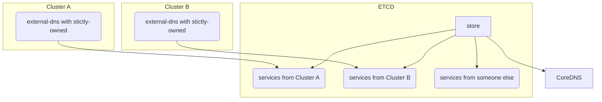

# CoreDNS

- [Documentation](https://coredns.io/)

## Multi cluster support options

The CoreDNS provider allows records from different CoreDNS providers to be separated in a single etcd
by activating the setting `--coredns-strictly-owned` flag and set `txt-owner-id`. It will prevent any
override (update/create/delete) of records by a different owner and prevent loading of records by a
different owner.

Flow:



This features works directly without any change to CoreDNS. CoreDNS will ignore this field inside the etcd record.

### Other entries inside etcd

Service entries in etcd without an `ownedby` field will be filtered out by the provider if `strictly-owned` is activated.
Warning: If you activate `strictly-owned` afterwards, these entries will be ignored as the `ownedby` field is empty.

### Ways to migrate to a multi cluster setup

Ways:

1. Add the correct owner to all services inside etcd by adding the field `ownedby` to the JSON.
2. Remove all services and allow them to be required again after restarting the provider. (Possible downtime.)

## Specific service annotation options

### Groups

Groups can be used to group set of services together. The main use of this is to limit recursion,
i.e. don't return all records, but only a subset. Let's say we have a configuration like this:

```yaml
[[% include 'tutorials/coredns/coredns-groups.yaml' %]]
```

And we want domain.local to return (127.0.0.1 and 127.0.0.2) and subdom.domain.local to return (127.0.0.3 and 127.0.0.4).
For this the two domains, need to be in different groups. What those groups are does not matter,
as long as a and b belong to the same group which is different from the group c and d belong to.
If a service is found without a group it is always included.
