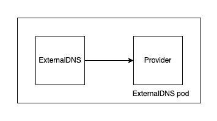

# Webhook provider

The "Webhook" provider allows integrating ExternalDNS with DNS providers through an HTTP interface.
The Webhook provider implements the `Provider` interface. Instead of implementing code specific to a provider, it implements an HTTP client that sends requests to an HTTP API.
The idea behind it is that providers can be implemented in separate programs: these programs expose an HTTP API that the Webhook provider interacts with.
The ideal setup for providers is to run as a sidecar in the same pod of the ExternalDNS container, listening only on localhost. This is not strictly a requirement, but we do not recommend other setups.

## Architectural diagram



## API guarantees

Providers implementing the HTTP API have to keep in sync with changes to the JSON serialization of Go types `plan.Changes`, `endpoint.Endpoint`, and `endpoint.DomainFilter`.
Given the maturity of the project, we do not expect to make significant changes to those types, but can't exclude the possibility that changes will need to happen.
We commit to publishing changes to those in the release notes, to ensure that providers implementing the API can keep providers up to date quickly.

## Implementation requirements

The following table represents the methods to implement mapped to their HTTP method and route.

### Provider endpoints

| Provider method | HTTP Method | Route            | Description                              |
| --------------- | ----------- | ---------------- | ---------------------------------------- |
| Negotiate       | GET         | /                | Negotiate `DomainFilter`                 |
| Records         | GET         | /records         | Get records                              |
| AdjustEndpoints | POST        | /adjustendpoints | Provider specific adjustments of records |
| ApplyChanges    | POST        | /records         | Apply record                             |

OpenAPI spec is [here](../../api/webhook.yaml).

ExternalDNS will also make requests to the `/` endpoint for negotiation and for deserialization of the `DomainFilter`.

The server needs to respond to those requests by reading the `Accept` header and responding with a corresponding `Content-Type` header specifying the supported media type format and version.

The default recommended port for the provider endpoints is `8888`, and should listen only on `localhost` (ie: only accessible for external-dns).

**NOTE**: only `5xx` responses will be retried and only `20x` will be considered as successful. All status codes different from those will be considered a failure on ExternalDNS's side.

### Exposed endpoints

| Provider method | HTTP Method | Route    | Description                                                                                  |
| --------------- | ----------- | -------- | -------------------------------------------------------------------------------------------- |
| K8s probe       | GET         | /healthz | Used by `livenessProbe` and `readinessProbe`                                                 |
| Open Metrics    | GET         | /metrics | Optional endpoint to expose [Open Metrics](https://github.com/OpenObservability/OpenMetrics) |

The default recommended port for the exposed endpoints is `8080`, and it should be bound to all interfaces (`0.0.0.0`)

## Custom Annotations

The Webhook provider supports custom annotations for DNS records. This feature allows users to define additional configuration options for DNS records managed by the Webhook provider. Custom annotations are defined using the annotation format `external-dns.alpha.kubernetes.io/webhook-<custom-annotation>`.

Custom annotations can be used to influence DNS record creation and updates. Providers implementing the Webhook API should document the custom annotations they support and how they affect DNS record management.

## Provider registry

To simplify the discovery of providers, we will accept pull requests that will add links to providers in this documentation.
This list will only serve the purpose of simplifying finding providers and will not constitute an official endorsement of any of the externally implemented providers unless otherwise stated.

## Run an ExternalDNS in-tree provider as a webhook

To test the Webhook provider and provide a reference implementation, we added the functionality to run ExternalDNS as a webhook. To run the AWS provider as a webhook, you need the following flags:

```yaml
- --webhook-server
- --provider=aws
- --source=ingress
```

The value of the `--source` flag is ignored in this mode.

This will start the AWS provider as an HTTP server exposed only on localhost.
In a separate process/container, run ExternalDNS with `--provider=webhook`.
This is the same setup that we recommend for other providers and a good way to test the Webhook provider.
